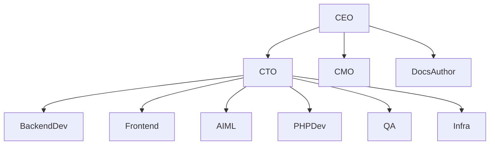

# AACsearch — Autonomous Coding Agent

> Full autonomous coding guide for AACsearch (search-as-a-service on supastarter Next.js monorepo).
> Location: `/Users/aac/Projects/ts/supastarter/`
> Symlink: `claude.md` → `agents.md` (do NOT edit claude.md directly)

---

## MODE: AUTONOMOUS

This AGENTS.md is designed for **fully autonomous operation**. The agent should:

1. Never stop to ask questions it can answer from project context
2. Follow every rule deterministically — if a choice exists, the rules below pick one
3. Execute tasks end-to-end: understand → analyze → implement → verify → commit
4. Only escalate to the user when truly blocked (ambiguous requirement, no existing pattern, schema change needed with frozen DB)

**Autonomous workflow: READ → PLAN → EXECUTE → VERIFY → COMMIT**

---

## 1. PROJECT DNA

```
Name:        AACsearch
Product:     Hosted search-as-a-service (AACsearch Engine)
Base:        supastarter Next.js monorepo
Stack:       TypeScript
Style:       strict, interfaces > types, named exports, no enums, RSC-first
Structure:   4 apps, 16 packages, 2 tooling, 11 API modules
Deploy:      [NOT SET — Coolify ready]
Active:      v0.5 (marketing) + R2.5 (Knowledge, dashboard, analytics pipeline)
Last:        Analytics events pipeline (events-public.ts, widget analytics)
```

### Tech Stack (exact versions)

| Technology       | Version  | Notes                                                         |
| ---------------- | -------- | ------------------------------------------------------------- |
| Next.js          | ^16.2.0  | App Router, RSC, Server Actions                               |
| React            | 19.2.4   | Server Components default                                     |
| TypeScript       | 6.0.2    | strict, target ES6 (override to ES2020 for BigInt)            |
| pnpm             | 10.28.2  | workspace catalog: versions via pnpm-workspace.yaml           |
| Turborepo        | ^2.9.4   | dotenv -c wrapper                                             |
| Tailwind CSS     | 4.2.2    | v4, no tailwind.config.ts, only @theme in theme.css           |
| Shadcn UI        | —        | 27 primitives in packages/ui/components/                      |
| Radix UI         | ^1.4.3   | accessible primitives                                         |
| oRPC             | 1.13.13  | type-safe RPC + TanStack Query                                |
| Hono             | ^4.12.11 | HTTP handler (mounts oRPC, webhooks, CORS, public endpoints)  |
| Better Auth      | 1.5.6    | auth, orgs, passkeys, 2FA, magic links, admin, OAuth          |
| Prisma           | 7.6.0    | ACTIVE ORM — 33 models (not 25!)                              |
| Drizzle (legacy) | ^0.45.2  | reference only — do NOT add new files                         |
| Zod              | ^4.3.6   | validation                                                    |
| TanStack Query   | ^5.96.2  | client data fetching                                          |
| react-hook-form  | ^7.72.1  | forms                                                         |
| Oxlint           | ^1.58.0  | LINT ONLY (NOT ESLint)                                        |
| Oxfmt            | ^0.43.0  | FORMAT ONLY (NOT Prettier)                                    |
| next-intl        | 4.9.0    | i18n — 5 locales x 4 scopes (saas+marketing split into files) |
| Typesense        | ^3.0.0   | search engine                                                 |
| OpenAI SDK       | ^6.33.0  | AI features (knowledge RAG, GraphRAG)                         |
| Vercel AI SDK    | ^6.0.146 | AI streaming                                                  |
| Hono             | ^4.12.11 | HTTP server, CORS, static file serving                        |
| Recharts         | ^3.8.1   | Charts (analytics dashboard)                                  |

### Locales: 5 (NOT 4)

**en, de, es, fr, ru** — every user-visible string in ALL 5.
Skipping `ru` is a production bug (next-intl falls back silently).
Verify: `rg '"key"' packages/i18n/translations/` → **5 hits** (not 4).

```
packages/i18n/translations/
  {en,de,es,fr,ru}/
    mail.json
    shared.json
    saas/          ← split: 8 файлов
      search.json, settings.json, admin.json, organizations.json,
      auth.json, onboarding.json, product.json, common.json
    marketing/     ← split: 5 файлов
      core.json, compare.json, features.json, integrations.json, solutions.json
```

**ВАЖНО: saas/ и marketing/ — это папки, не файлы!** `get-messages.ts` сливает split-файлы при загрузке. С точки зрения приложения API не изменился (`SaasMessages`, `MarketingMessages`, `getMessagesForLocale`).

---

## 2. AUTONOMOUS TASK EXECUTION PROTOCOL

### Phase 1: READ agents.md (ALWAYS first)

Load the full context from this file. Scan sections relevant to the task. Load PRD docs from `docs/plans/aacsearch/` for roadmap context.

### Phase 2: UNDERSTAND (always, 2 min max)

```markdown
1. Read task text twice — note every constraint
2. Classify scope by PRD:
    - v0.x (search core) ✅ — PROCEED
    - v0.5 (marketing site) ✅ — PROCEED
    - v0.6/v0.7/v1.0 → DEFER — ask user
    - wallet/ai-core/billing → DEFER — ask user
3. memory_search() for related facts and gotchas
4. If touching existing code → code_search() for relevant symbols
5. State plan in <plan> block before writing any code
```

### Phase 3: ANALYZE (mandatory greps before ANY new file)

```bash
rg -l "<ComponentName|functionName|concept>" apps/saas/modules apps/marketing/modules packages/api/modules
rg -l "<concept>" packages/database/prisma/queries/
ls packages/ui/components/ | grep -i <concept>
ls apps/saas/modules/shared/components/ | grep -i <concept>
# If result EXISTS → USE IT. Say why existing isn't enough if still creating new.
```

### Phase 4: EXECUTE (surgical changes only)

- Touch only what the task requires
- Match existing style exactly (tabs for indentation, named exports, interfaces not types)
- Clean only your own orphans (imports, variables) — not pre-existing dead code
- 3-layer UI ranking: feature blocks → shared blocks → primitives
- NO console.log — use `logger` from `@repo/logs`
- NO any types unless absolutely required
- NO enums — use `as const` objects or string unions

### Phase 5: VERIFY (mandatory gates — ALL must pass)

```bash
# Gate 1: Type check (affected packages first, then workspace)
pnpm --filter @repo/api type-check
pnpm --filter @repo/search type-check
pnpm --filter @repo/widget type-check  # if widget changed
pnpm type-check --filter='!saas' --filter='!marketing' --filter='!docs' || true

# Gate 2: Lint (0 errors, 0 warnings)
pnpm lint
pnpm lint:fix  # if fails

# Gate 3: Format
pnpm format && pnpm format:check

# Gate 4: i18n (5 LOCALES — NOT 4!)
# If user-visible strings changed: MUST update ALL 5 locale files
rg '"your\.key"' packages/i18n/translations/  # → 5 hits (en,de,es,fr,ru)
# Validate JSON integrity after patch edits:
python3 -c "import json, glob; [json.load(open(f)) or print(f'OK: {f}') for f in glob.glob('packages/i18n/translations/**/*.json', recursive=True)]"

# Gate 5: File structure
# New module → router.ts mounted in packages/api/orpc/router.ts?
# New component → follows 3-layer ranking?
# New query → in packages/database/prisma/queries/, not drizzle/?
```

### Phase 6: COMMIT

```bash
git add -A
git commit -m "[type] what and why"
# Types: feat, fix, refactor, docs, chore, i18n, style
# ALWAYS: pnpm lint && pnpm type-check before commit
# Update CHANGELOG.md if consumer-facing change
```

---

## 3. HARD INVARIANTS (NEVER violate)

### Invariant 1: Split-app only

**No `apps/web/*`.** Only: `apps/saas`, `apps/marketing`, `apps/docs`, `apps/mail-preview`.

### Invariant 2: DB-first ingest

Public write requests enqueue into `SearchIngestBuffer` (via `enqueueManySearchIngest`). Only the worker calls `bulkUpsert`. NEVER call `bulkUpsert` from a request handler. Reindex is the only other allowed caller.

### Invariant 3: API keys hash-only

`SearchApiKey.hashedKey` is the only stored form. Plaintext shown **once** at creation, never logged, never returned on read. Prefixes: `ss_search_*`, `ss_connector_*`, `ss_scoped_*`.

### Invariant 4: Scoped tokens narrow, never widen

`verifyScopedSearchToken()` returns a `scopedFilter` that is AND-combined with caller filters via `combineFilters()`. Never bypass `combineFilters` or apply scoped filter as OR.

### Invariant 5: Tenant isolation

Every search call passes `tenantId: verified.organizationId`. No cross-org reads, ever.

### Invariant 6: No raw Typesense errors to client

Map upstream failures to typed JSON errors (`{ error: "search_failed" }` → 502, etc.). Never echo `error.message` from Typesense.

### Invariant 7: BigInt over oRPC

Every BigInt field in procedure output schemas MUST `.transform(v => v.toString())`. oRPC JSON serializer cannot serialize BigInt. If package doesn't support BigInt literals (`0n`), override tsconfig target to ES2020.

### Invariant 8: Money in kopecks (BigInt minor units)

Wallet ledger and pricing use BigInt minor units. Conversion to display strings only at UI/email surface. Use `BigInt(0)` not `0n` (shared tsconfig = ES6).

### Invariant 9: DB is FROZEN

**No Prisma migrations / schema deltas without explicit user approval.** Any feature requiring new persistence must call out the DB change upfront. Until approved, build on 33 existing models.

### Invariant 10: i18n ALL 5 locales

Every user-visible string lands in ALL 5 locales (en, de, es, fr, **ru**) in the SAME change. Skipping ru = production bug. Verify: `rg '"key"' packages/i18n/translations/` → 5 hits.

### Invariant 11: REUSE FIRST — GREP BEFORE WRITE

Before creating ANY new file: run the grep. 3-layer UI ranking: feature blocks → shared blocks → primitives. API: extend existing module. DB: extend existing query file. Zod: use generated `<Model>Schema` from `@repo/database` — NEVER hand-write.

### Invariant 12: Prisma is active ORM

`packages/database/index.ts` re-exports only `./prisma`. Drizzle/ is legacy reference only — NOT wired. New queries go in `packages/database/prisma/queries/<area>.ts`.

### Invariant 13: agents.md = claude.md (symlink)

Edit only `agents.md`. `claude.md` is a symlink — it updates automatically. Do not create a divergent `claude.md`.

### Invariant 14: Lint/Format = Oxlint + Oxfmt ONLY

**NOT Biome, NOT ESLint, NOT Prettier.** Never install or import these tools.

### Invariant 15: Removed code STAYS removed

Do not recreate: `wallet-sync.ts`, `sync-subscriptions` cron, DSLMRank rules, archive/ docs.

### Invariant 16: Money is never numeric/decimal

Always `BigInt` minor units. Always over oRPC: `.transform(v => v.toString())`. Always in Prisma: `BigInt @default(0)`.

### Invariant 17: No console.log in production

Only use `logger` from `@repo/logs` (pino-based). `console.log` in committed code = lint error.

### Invariant 18: JSON fields — explicit casts

JSON fields: cast read as `Record<string, unknown>`, cast write as `Prisma.InputJsonValue`.

### Invariant 19: Organization has NO updatedAt

Do not reference `org.updatedAt`.

---

## 4. AUTONOMOUS DECISION GATES

### Gate A: Schema change needed?

→ If the task needs a new DB column/model: **STOP**. State what you need and why. Do not proceed without user approval (Invariant 9).

### Gate B: New env variable needed?

→ Add it to `.env.local.example` AND `.env.local`. Pick `NEXT_PUBLIC_` prefix only if browser needs it. Add a default/fallback in code so the app doesn't crash without it.

### Gate C: New UI component?

→ 1) `packages/ui/components/` (27 primitives) → 2) `apps/saas/modules/shared/components/` → 3) `apps/saas/modules/<feature>/components/`. If nothing matches: Layer 3, NOT `@repo/ui` or `@shared`. Add a prop before creating new.

### Gate D: New API procedure?

→ Extend an existing module in `packages/api/modules/<existing>/procedures/`. Only create new module if genuinely new domain. Mount in `packages/api/orpc/router.ts`.

### Gate E: New DB query?

→ Extend existing file in `packages/database/prisma/queries/<area>.ts`. New file only if area is new and has ≥2 query functions.

### Gate F: New notification type?

→ Add to `NotificationType` enum in schema.prisma → **STOP — schema change (Gate A)**. Push only after approval. Update `packages/notifications/types.ts` + `catalog.ts`. Add i18n labels in ALL 5 locales.

### Gate G: BigInt in output?

→ ALWAYS `.transform(v => v.toString())` in oRPC output schema. Override tsconfig target to ES2020 for BigInt literals.

### Gate H: Marketing page (v0.5)?

→ PROCEED. Add translation keys in ALL 5 locales. Use existing blocks from `apps/marketing/modules/shared/components/` first.

### Gate I: Wallet/ai-core/half-orphaned?

→ **CONFIRM with user first.** These domains are not wired to search billing yet. Do not extend without explicit task.

### Gate J: Docs or self-host?

→ **DEFER** (v0.7 / v1.0). Ask user before implementing.

### Gate K: Stripe billing for search-units?

→ **DEFER** (v0.6). Ask user before implementing.

### Gate L: New workspace package?

→ **CONFIRM with user.** 16 already exist. New package needs ≥2 internal consumers OR customer-facing SDK use case.

### Gate M: Dependency added?

→ Use `pnpm add <pkg> --filter <workspace-package>`. Prefer existing `catalog:` versions in `pnpm-workspace.yaml`. Avoid adding deps that can be done with existing tech.

### Gate N: Test needed?

→ If touching business logic: add/update Vitest test. If touching a page/flow: add/update Playwright E2E test. If bug fix: reproduce with a failing test FIRST, then fix.

---

## 5. TASK TYPE → AUTONOMOUS WORKFLOW

### Task Type 1: Add new SaaS feature (DB → API → UI → i18n)

```bash
STEP 1: DB queries
  # Extend packages/database/prisma/queries/<feature>.ts
  # NO schema changes (Invariant 9) — query existing 33 models
  Verify: pnpm --filter @repo/database type-check

STEP 2: API procedures
  # Create or extend packages/api/modules/<feature>/
  # Structure: types.ts (zod), procedures/<action>.ts, router.ts
  # Choose procedure type: publicProcedure / protectedProcedure / adminProcedure
  # BigInt outputs → .transform(v => v.toString())
  # Mount in packages/api/orpc/router.ts
  Verify: pnpm --filter @repo/api type-check

STEP 3: UI components
  # apps/saas/modules/<feature>/components/<Component>.tsx
  # RSC default, "use client" only for interactivity
  # Use existing 3-layer components (Gate C)
  # react-hook-form + zod for forms
  # TanStack Query via orpc from @shared/lib/orpc-query-utils
  # Session via @auth/hooks/use-session (client) or @auth/lib/server (server)

STEP 4: i18n (ALL 5 LOCALES — en, de, es, fr, ru)
  # saas scope → split-файлы в packages/i18n/translations/{en,de,es,fr,ru}/saas/
  #   search.json | settings.json | admin.json | organizations.json | auth.json
  #   onboarding.json | product.json | common.json
  # Используй скрипт: python3 packages/i18n/scripts/i18n.py set saas <key> <en> <de> <es> <fr> <ru>
  # Скрипт автоматически определяет правильный файл по top-level ключу.
  # ALL 5 locales in same change. ru is NOT optional.
  # Scope: saas-only → saas/, cross-app → shared.json

STEP 5: Verify
  # pnpm type-check && pnpm lint && pnpm format:check
  # rg '"your.key"' packages/i18n/translations/ → 5 hits
```

### Task Type 2: Add marketing page (v0.5 current focus)

```bash
STEP 1: i18n keys (ALL 5 locales)
  # marketing scope → split-файлы в packages/i18n/translations/{en,de,es,fr,ru}/marketing/
  #   core.json | compare.json | features.json | integrations.json | solutions.json
  # Используй скрипт: python3 packages/i18n/scripts/i18n.py set marketing <key> <en> <de> <es> <fr> <ru>
  # Скрипт автоматически определяет файл по prefix ключа.

STEP 2: Route
  # apps/marketing/app/[locale]/<route>/page.tsx
  # Server Component by default
  # setRequestLocale(locale) in server component
  # Compose from existing blocks: HeroSection, FeaturesGrid, HowItWorks, CtaFooter, PricingPlans, ContactForm

STEP 3: New sections
  # apps/marketing/modules/<area>/components/<Section>.tsx

STEP 4: Sitemap
  # apps/marketing/app/sitemap.ts if page is public

STEP 5: Verify
  # pnpm --filter marketing type-check
  # pnpm dev --filter=marketing → visual check :3001
```

### Task Type 3: Search feature (public-handler / ingest / keys / tokens)

```bash
!! CRITICAL: Re-read Invariants 2-6 before any change !!

STEP 1: Understand current flow
  # packages/search/lib/{client,collections,buffer,reindex,search}.ts
  # packages/api/modules/search/{public-handler,lib/public-auth,lib/scoped-token}.ts
  # @repo/search-client (browser SDK)
  # packages/api/modules/search/events-public.ts (analytics events)

STEP 2: Implement
  # Respect: DB-first ingest, tenant isolation, no raw errors, hash-only keys, scoped tokens narrow
  # Partial-fail handling: markIngestRowsSuccess / markIngestRowsFailure with exponential backoff
  # Reindex: alias-swap atomic (keep previous version until traffic confirms green)

STEP 3: Verify
  # pnpm --filter @repo/search type-check
  # pnpm --filter @repo/api type-check
  # Check: no bulkUpsert from request path, tenantId everywhere, no error.message leak
```

### Task Type 4: Bug fix

```bash
!! MANDATORY: Reproduce FIRST !!

STEP 1: Reproduce
  # Create a failing test or documented manual repro
  # Never fix something you didn't reproduce

STEP 2: Root cause
  # Use systematic-debugging skill
  # Check memory_search() for related past bugs

STEP 3: Fix + verify
  # Same repro now passes
  # Adjacent tests still pass (pnpm --filter <package> test)
  # pnpm type-check && pnpm lint
```

### Task Type 5: Rebrand / rename

```bash
STEP 1: Search all references
  # rg -r '<old_name>' apps packages tooling --include '*.ts' --include '*.tsx' --include '*.json' --include '*.md'

STEP 2: File renames
  # git mv old-name.ts new-name.ts

STEP 3: Verify
  # pnpm type-check — must be clean
  # rg '<old_name>' apps packages — must return 0 hits (excluding pnpm-lock.yaml, .git)
  # Update CHANGELOG.md
```

### Task Type 6: Analytics / events

```bash
STEP 1: Understand event flow
  # Widget → POST /api/events/track → recordSearchUsage (SearchUsageEvent table)
  # oRPC procedures: usage, usageSummary, topQueries, recentActivity, analytics
  # Widget events: search_query, zero_results, result_click, widget_open, filter_used
  # Server events: search_query (with metadata), zero_results, sync_job

STEP 2: Implement
  # Widget analytics: apps/saas/modules/search/components/SearchAnalyticsCards.tsx
  # Events endpoint: packages/api/modules/search/events-public.ts
  # oRPC analytics: packages/api/modules/search/procedures/analytics.ts
  # Activity feed: packages/api/modules/search/procedures/recent-activity.ts

STEP 3: Verify
  # pnpm --filter @repo/api type-check
  # pnpm --filter @repo/widget type-check (if widget changed)
```

---

## 6. SEARCH ARCHITECTURE (deep reference)

### Key files

| Area             | File                                               | Responsibility                                  |
| ---------------- | -------------------------------------------------- | ----------------------------------------------- |
| Typesense client | `packages/search/lib/client.ts`                    | Connection, collection creation, document ops   |
| Collections      | `packages/search/lib/collections.ts`               | Schema definitions, version naming, alias swap  |
| Reindex          | `packages/search/lib/reindex.ts`                   | Versioned zero-downtime reindex                 |
| Ingest buffer    | `packages/search/lib/buffer.ts`                    | DB queue → worker → Typesense                   |
| Search           | `packages/search/lib/search.ts`                    | searchDocuments / multiSearchDocuments          |
| API keys         | `packages/search/lib/keys.ts`                      | Key generation + hashing                        |
| Maintenance      | `packages/search/lib/maintenance.ts`               | Expired keys, rate limit cleanup                |
| Ingest           | `packages/search/lib/ingest.ts`                    | Document ingestion logic                        |
| Public handler   | `packages/api/modules/search/public-handler.ts`    | Auth gate + search endpoint                     |
| Public auth      | `packages/api/modules/search/lib/public-auth.ts`   | API key verification, rate limit, quota         |
| Scoped tokens    | `packages/api/modules/search/lib/scoped-token.ts`  | HMAC token generation + verification            |
| Quota            | `packages/api/modules/search/lib/quota.ts`         | Per-plan quota check middleware                 |
| Access           | `packages/api/modules/search/lib/access.ts`        | Access control helpers                          |
| Analytics events | `packages/api/modules/search/events-public.ts`     | POST /api/events/track for widget/SDK           |
| Analytics proc   | `packages/api/modules/search/analytics-handler.ts` | Analytics query endpoint                        |
| Admin oRPC       | `packages/api/modules/search/procedures/*`         | 26 procedures over indexes, keys, tokens, usage |
| SCIM             | `packages/api/modules/search/scim-public.ts`       | SCIM 2.0 identity provisioning                  |
| Connector API    | `packages/api/modules/search/connector-public.ts`  | CMS connector API (7 endpoints)                 |
| Browser SDK      | `packages/search-client/src/index.ts`              | Customer-facing search client                   |

### Search Module oRPC Procedures (26 total)

| Procedure                | Type | Description                   |
| ------------------------ | ---- | ----------------------------- |
| `listIndexes`            | oRPC | List all indexes for org      |
| `createIndex`            | oRPC | Create new search index       |
| `importDocuments`        | oRPC | Bulk import via UI            |
| `importJobs`             | oRPC | Import job history            |
| `upsertDocument`         | oRPC | Single doc upsert             |
| `listApiKeys`            | oRPC | List API keys                 |
| `createApiKey`           | oRPC | Create API key                |
| `createScopedToken`      | oRPC | Create HMAC scoped token      |
| `revokeApiKey`           | oRPC | Revoke API key                |
| `reindex`                | oRPC | Trigger alias-swap reindex    |
| `usage`                  | oRPC | Raw usage events              |
| `usageSummary`           | oRPC | Aggregated usage              |
| `topQueries`             | oRPC | Most frequent queries         |
| `recentActivity`         | oRPC | Activity feed for dashboard   |
| `widgetConfig`           | oRPC | Widget snippet config         |
| `analytics`              | oRPC | Analytics data                |
| `pipelineStatus`         | oRPC | Ingest pipeline health        |
| `listDocuments`          | oRPC | List indexed documents        |
| `onboardingStatus`       | oRPC | Self-deriving checklist state |
| `retryFailedBatches`     | oRPC | Retry failed ingest batches   |
| `schema.{get,update}`    | oRPC | Collection schema management  |
| `synonyms.{get,update}`  | oRPC | Synonym management            |
| `curations.{get,update}` | oRPC | Curations management          |
| `listConnectorTokens`    | oRPC | Connector tokens              |
| `createConnectorToken`   | oRPC | Create connector token        |
| `revokeConnectorToken`   | oRPC | Revoke connector token        |
| `listConnectorSyncJobs`  | oRPC | Sync job history              |

### Data flow: Write path

```
Request → public-handler.ts (auth check) → enqueueManySearchIngest (DB insert)
  → worker picks up unprocessed rows → bulkUpsert to Typesense
  → markIngestRowsSuccess / markIngestRowsFailure (with exponential backoff)
```

### Data flow: Read path

```
Request → public-handler.ts (auth + rate limit + quota) → searchDocuments / multiSearchDocuments
  → Typesense response → sanitized JSON (no raw errors)
  → recordSearchUsage (async, with full metadata: q, filters, resultCount, latencyMs, UA, referrer)
```

### Data flow: Analytics events (widget → backend)

```
Widget trackEvent() → POST /api/events/track (Bearer ss_search_*)
  → events-public.ts → recordSearchUsage (SearchUsageEvent table)
  → Event types: search_query, zero_results, result_click, widget_open, filter_used
  → Widget events include sessionId, locale, referrer via fetch keepalive
```

### Collection management

- Each index is versioned: `{orgShortId}_{slug}_v{version}`
- Alias maps to current version: `{orgShortId}_{slug}`
- Reindex creates `_v{newVersion}` → verifies → atomically swaps alias
- Old version kept until next reindex confirms green

### Token system

- **API keys**: `ss_search_*` prefix, hashed in DB, shown once. Scopes: `search`, `ingest`, `admin`, `connector_write`
- **Scoped tokens**: `ss_scoped_*` prefix, HMAC over BETTER_AUTH_SECRET, narrows permissions (AND-combined)
- **Connector tokens**: `ss_connector_*` prefix, reuse `SearchApiKey` with `connector_write` scope

### Connector API (8 public endpoints)

All mounted on `/api` with permissive CORS:

| Method | Path                                            | Purpose                                |
| ------ | ----------------------------------------------- | -------------------------------------- |
| POST   | `/api/connectors/handshake`                     | Verify token, return index info        |
| POST   | `/api/connectors/:connectorId/heartbeat`        | Keepalive                              |
| POST   | `/api/projects/:projectId/sync/full`            | Full sync — enqueue all products       |
| POST   | `/api/projects/:projectId/sync/delta`           | Delta sync — enqueue changed only      |
| DELETE | `/api/projects/:projectId/products/:externalId` | Delete single product by external ID   |
| DELETE | `/api/connector/documents`                      | Batch delete documents by external IDs |
| POST   | `/api/projects/:projectId/diagnostics`          | Send diagnostics report                |
| GET    | `/api/projects/:projectId/sync/jobs/:jobId`     | Get sync job status                    |

### SCIM 2.0

| Method | Path                                 | Purpose        |
| ------ | ------------------------------------ | -------------- |
| GET    | `/api/scim/v2/ServiceProviderConfig` | SCIM config    |
| GET    | `/api/scim/v2/Users`                 | List users     |
| POST   | `/api/scim/v2/Users`                 | Create user    |
| GET    | `/api/scim/v2/Users/{id}`            | Get user       |
| PUT    | `/api/scim/v2/Users/{id}`            | Update user    |
| PATCH  | `/api/scim/v2/Users/{id}`            | Partial update |
| DELETE | `/api/scim/v2/Users/{id}`            | Delete user    |
| GET    | `/api/scim/v2/Groups`                | List groups    |
| POST   | `/api/scim/v2/Groups`                | Create group   |
| GET    | `/api/scim/v2/Groups/{id}`           | Get group      |
| PUT    | `/api/scim/v2/Groups/{id}`           | Update group   |
| DELETE | `/api/scim/v2/Groups/{id}`           | Delete group   |

Note: SCIM base path is `/scim/v2` (not `/api/scim/v2`). App is already on `/api`.

---

## 7. AUTH SYSTEM (deep reference)

### Better Auth setup

`packages/auth/auth.ts` configures:

- Database: Prisma adapter (PostgreSQL)
- Session: 30-day expiry, impersonation support
- Features: email/password, magic links, passkeys, 2FA (TOTP), OAuth (Google + GitHub), username, admin, organizations, invitation-only
- Hooks: cancel subscriptions on user/org delete, update seat count on invitation accept/member removal
- Email: verification, forgot password, magic link, organization invitation

### Auth config (`packages/auth/config.ts`)

```typescript
export const config = {
	enableSignup: true,
	enableMagicLink: true,
	enableSocialLogin: true,
	enablePasskeys: true,
	enablePasswordLogin: true,
	enableTwoFactor: true,
	sessionCookieMaxAge: 60 * 60 * 24 * 30,
	users: { enableOnboarding: true },
	organizations: {
		enable: true,
		hideOrganization: false,
		enableUsersToCreateOrganizations: true,
		requireOrganization: false,
		forbiddenOrganizationSlugs: [
			"new-organization",
			"admin",
			"settings",
			"ai-demo",
			"organization-invitation",
			"chatbot",
		],
	},
};
```

### Session access patterns

| Context              | Import                                                                                 | Usage                                                                         |
| -------------------- | -------------------------------------------------------------------------------------- | ----------------------------------------------------------------------------- |
| Server Component     | `import { getSession } from "@auth/lib/server"`                                        | `const session = await getSession()`                                          |
| Client Component     | `import { useSession } from "@auth/hooks/use-session"`                                 | `const { user, loaded } = useSession()`                                       |
| oRPC procedure       | `protectedProcedure` or `adminProcedure`                                               | `context.user`, `context.session`                                             |
| Org context (client) | `import { useActiveOrganization } from "@organizations/hooks/use-active-organization"` | `const { activeOrganization, isOrganizationAdmin } = useActiveOrganization()` |

---

## 8. shadcn/ui SYSTEM & COMPONENT CATALOG

### 📖 shadcn v4 Philosophy ("Copy-Paste, Not npm Install")

**Core principle:** shadcn is NOT a component library — it's HOW you build YOUR component library.

- Every component file is COPIED into your repo (`packages/ui/components/`). You own the full code.
- Edit the SOURCE files directly. **Never wrap shadcn components** — modify the `.tsx` if you need different styles.
- Composition over props: compose `Card > CardHeader > CardTitle > CardContent` — don't add props like `<Card title="..." content="..." />`.
- Components receive `className` via `cn()` utility — always merge, never strip.
- The `data-slot` pattern (v4): use `data-slot="card"`, `data-slot="button"` etc. for CSS targeting instead of complex class selectors.

### 🔴 HARD INVARIANTS

1. **NO raw card divs** — always use `<Card>` from `@repo/ui`
2. **NO wrapping shadcn components** — edit the .tsx source directly
3. **NO `*` barrel imports** — `import { Button } from "@repo/ui/components/button"`, NOT `from "@repo/ui"`
4. **NO app logic inside `packages/ui/`** — business logic belongs in `apps/*/modules/`
5. **Button does NOT support `forwardRef`** — use native `<button>` + `buttonVariants()` for refs
6. **IMPORT via `@repo/ui/components/<name>`** — **always** use components path, not barrel

### 🛠 shadcn CLI (v4)

```bash
# Install missing component
pnpm dlx shadcn@latest add <component> -c packages/ui

# Search available components
pnpm dlx shadcn@latest search

# Get docs from CLI
pnpm dlx shadcn@latest docs

# Migrate from old styles
pnpm dlx shadcn@latest migrate

# Info about project setup
pnpm dlx shadcn@latest info
```

### 🔴 HARD RULE: NO raw card divs — USE shadcn Card

**Запрещено:**

```
<div className="rounded-lg border p-4 ...">         ❌
<div className="rounded-md border overflow-x-auto">  ❌
<div className="rounded-lg border bg-card">          ❌
<div className="rounded-lg border border-dashed">    ❌ (use Card + custom className)
```

**Правильно:**

```tsx
import { Card, CardContent, CardHeader, CardTitle } from "@repo/ui/components/card";

<Card className="rounded-lg border">
<Card><CardContent className="p-4 space-y-3">...</CardContent></Card>
<Card className="overflow-x-auto rounded-lg border"><CardContent className="p-0">
```

**Card API:**

```
Card        = <div className="rounded-3xl border bg-card text-card-foreground">
CardHeader  = <div className="space-y-1.5 p-6 pb-4 flex flex-col">
CardTitle   = <h3 className="font-medium text-lg leading-none">
CardDescription = <p className="text-sm text-muted-foreground">
CardContent = <div className="p-6 pt-0">
CardFooter  = <div className="p-6 pt-0 flex items-center">
```

### 🎯 Component Reuse Rules

**3-layer ranking (always check BEFORE creating new):**

1. **`@repo/ui/components/*`** — shadcn primitives (52 installed)
2. **`apps/*/modules/shared/components/`** — app-level shared blocks
3. **`apps/*/modules/<feature>/components/`** — feature-specific

**Key patterns:**

- **Composition:** shadcn uses compound components. Compose in app-level files, don't add props.
- **asChild / Slot:** Radix-based components support `asChild` for polymorphic rendering.
- **Button `loading` prop** — use instead of custom loading states. No Spinner inside buttons.
- **`cn()`** from `@repo/ui` — always for className merging. Never clsx/twMerge directly.

### 📦 Layer 1 — `@repo/ui/components/*` (75 components)

**52 shadcn primitives:**
`accordion`, `alert`, `alert-dialog`, `aspect-ratio`, `avatar`, `badge`, `breadcrumb`, `button`, `button-group`, `calendar`, `card`, `carousel`, `chart`, `checkbox`, `collapsible`, `command`, `context-menu`, `dialog`, `drawer`, `dropdown-menu`, `field`, `form`, `hover-card`, `input`, `input-otp`, `kbd`, `label`, `logo`, `menubar`, `navigation-menu`, `pagination`, `popover`, `progress`, `radio-group`, `resizable`, `scroll-area`, `select`, `separator`, `sheet`, `sidebar`, `skeleton`, `slider`, `sonner`, `spinner`, `switch`, `table`, `tabs`, `textarea`, `toast`, `toggle`, `toggle-group`, `tooltip`

**13 Landing blocks** (from PageAI-Pro/page-ui, 1.6K⭐):
`GlowBg`, `LandingBand`, `LandingFeature`, `LandingFeatureList`, `LandingPricingSection`, `LandingPricingPlan`, `LandingFooter`, `LandingFooterColumn`, `LandingFooterLink`, `LandingPrimaryCta`, `LandingSaleCta`, `LandingVideoPlayer`, `LandingImage`

**6 Chat components** (from jakobhoeg/shadcn-chat, 1.6K⭐):
`ChatBubble`, `ChatInput`, `ChatMessageList`, `ExpandableChat`, `MessageLoading` — в `components/chat/`

**4 Specialized components:**
`Tour`, `Timeline`, `Stepper` (`defineStepper`, `Stepper.Root`, etc.), `Billing` (re-export hub для billingsdk)

**Button variants:** `primary` (default), `secondary`, `outline`, `ghost`, `destructive`, `link`. Has `loading` prop. **NO forwardRef** — use native button + `buttonVariants()`.
**Badge:** uses `status` prop: `success` / `info` / `warning` / `error`.

### 🏗 Layer 2 — SaaS Shared (`@shared/components/*`)

`AppWrapper`, `AuthWrapper`, `ClientProviders`, `ApiClientProvider`, `ConsentProvider` + `ConsentBanner`, `ConfirmationAlertProvider`, `NavBar`, `Footer`, `UserMenu`, `UserAvatar`, `NotificationCenter`, `ColorModeToggle`, `LocaleSwitch`, `Pagination`, `PageHeader`, `TabGroup`, `SettingsList` + `SettingsItem`, `StatsTile`, `StatsTileChart`, `PasswordInput`

Hooks: `@shared/hooks/locale-currency`, `@shared/lib/sidebar-context`.

### 🔧 Layer 3 — Search feature components (29 files)

`apps/saas/modules/search/components/`:
`BillingPlanInfo`, `ConnectorCard`, `ConnectorWizard`, `ConnectorsPage`, `CreateSearchIndexDialog`, `CurationsPanel`, `DashboardOverview`, `EmptyState`, `GettingStarted`, `ImportJobsPanel`, `IndexRowActions`, `KnowledgeWorkbench`, `OverviewPage`, `PlaygroundPanel`, `ProjectOverview`, `ProjectsList`, `RelevanceTabs`, `SearchAnalyticsCards`, `SearchApiKeysPage`, `SearchApiKeysPanel`, `SearchDashboard`, `SearchIndexesList`, `SearchPreview`, `SearchPreviewPage`, `SearchUsageCard`, `SearchUsageCards`, `SyncJobsTable`, `SynonymsPanel`, `WidgetPanel`

### 🚫 NEVER create from scratch (hard NO list):

- ❌ `Pagination` — use `@shared/components/Pagination`
- ❌ `UserAvatar` / `OrganizationLogo` — handle initials + sizes
- ❌ Confirmation dialog — use `ConfirmationAlertProvider`'s `useConfirmationAlert()`
- ❌ Toast — `sonner`'s `toast.success/error/info` is wired
- ❌ Settings rows — use `SettingsList` + `SettingsItem`
- ❌ `cn()` — import from `@repo/ui`
- ❌ Session hook — use `@auth/hooks/use-session`
- ❌ Active org hook — use `@organizations/hooks/use-active-organization`
- ❌ `Loading` / `Spinner` / `LoadingButton` — Button has `loading` prop; use `Skeleton` / `Spinner`
- ❌ Form wrappers — use shadcn `Form*` directly with react-hook-form
- ❌ Wrapping shadcn components — edit the .tsx directly
- ❌ Barrel imports from `@repo/ui` — use `@repo/ui/components/<name>`
- ❌ forwardRef on Button — doesn't support it; use native `<button>` + `buttonVariants()`

### 🌐 Marketing shared components

`apps/marketing/modules/shared/components/`:
`NavBar`, `Footer`, `ClientProviders`, `ConsentProvider` + `ConsentBanner`, `ColorModeToggle`, `ThemeProvider`, `LocaleSwitch`

### 🏠 Marketing home page sections

`apps/marketing/modules/home/components/`:
`HeroSection`, `HeroWithCode`, `FeaturesGrid`, `HowItWorks`, `CtaFooter`, `PricingPlans`, `ContactForm`

---

## 9. i18n SYSTEM

### File structure (5 locales × split files)

```
packages/i18n/translations/
  {en,de,es,fr,ru}/
    mail.json                 ← email templates (не менять структуру)
    shared.json               ← cross-app строки (не менять структуру)
    saas/                     ← split: 8 файлов (apps/saas only)
      search.json             — namespace: search (самый большой ~1465 строк)
      settings.json           — namespace: settings
      admin.json              — namespace: admin
      organizations.json      — namespace: organizations
      auth.json               — namespace: auth
      onboarding.json         — namespaces: onboarding, choosePlan, checkoutReturn, start
      product.json            — namespaces: indexing, mySearch, widget, sdks, analytics, feedback, referral
      common.json             — namespaces: app, common, nav, notFound, documentation
    marketing/                ← split: 5 файлов (apps/marketing only)
      core.json               — home, blog, changelog, about, careers, roadmap, faq, ...
      compare.json            — compare*, vsAlgolia*
      features.json           — features*
      integrations.json       — integrations*
      solutions.json          — solutions*, useCases*
```

**Загрузка:** `get-messages.ts` сливает все split-файлы при загрузке через `Promise.all` + `Object.assign`. API приложений (`SaasMessages`, `MarketingMessages`, `getMessagesForLocale`) не изменился.

**Редактировать переводы ТОЛЬКО через скрипт** (Invariant: запрещено редактировать JSON напрямую):

```bash
python3 packages/i18n/scripts/i18n.py set saas search.myKey "en text" "de text" "es text" "fr text" "ru text"
python3 packages/i18n/scripts/i18n.py set marketing featuresWidget.title "en" "de" "es" "fr" "ru"
# Скрипт автоматически определяет правильный файл по namespace ключа.
```

### Scope selection

| Scope       | Файлы                         | Used by              |
| ----------- | ----------------------------- | -------------------- |
| `saas`      | `saas/*.json` (8 файлов)      | apps/saas only       |
| `marketing` | `marketing/*.json` (5 файлов) | apps/marketing only  |
| `shared`    | `shared.json`                 | Cross-app strings    |
| `mail`      | `mail.json`                   | Email templates only |

### Usage

```typescript
// Server Component
import { setRequestLocale } from "next-intl/server";
export default async function Page({ params }: { params: Promise<{ locale: string }> }) {
  const { locale } = await params;
  setRequestLocale(locale);
}

// Client Component
"use client";
import { useTranslations } from "next-intl";
const t = useTranslations("search");
return <h1>{t("dashboard.title")}</h1>;
```

### Rules

- **NEVER skip `ru`** — ALL 5 locales must have the key
- **NEVER edit split JSON files directly** — используй `python3 packages/i18n/scripts/i18n.py`
- Marketing site uses `[locale]` segment in URL
- SaaS app detects locale via cookie (`NEXT_LOCALE`)
- i18n config at `packages/i18n/config.ts` — defines 5 locales, defaultLocale: "en"
- `ru` uses RUB currency; others use USD
- Validate JSON integrity after patch edits: `python3 -c "import json,glob; [json.load(open(f)) for f in glob.glob('packages/i18n/translations/**/*.json', recursive=True)]"`

---

## 10. KNOWLEDGE MODULE (RAG/GraphRAG)

### Architecture

The Knowledge module is a separate product surface for internal Q&A over documents (not storefront search). Files:

| File                                                               | Purpose                             |
| ------------------------------------------------------------------ | ----------------------------------- |
| `packages/api/modules/knowledge/types.ts`                          | Zod schemas for Knowledge module    |
| `packages/api/modules/knowledge/router.ts`                         | oRPC router                         |
| `packages/api/modules/knowledge/procedures/list-spaces.ts`         | List knowledge spaces               |
| `packages/api/modules/knowledge/procedures/create-space.ts`        | Create space                        |
| `packages/api/modules/knowledge/procedures/list-sources.ts`        | List data sources per space         |
| `packages/api/modules/knowledge/procedures/create-source.ts`       | Create data source                  |
| `packages/api/modules/knowledge/procedures/list-ingestion-jobs.ts` | List ingestion jobs                 |
| `packages/api/modules/knowledge/procedures/ingest-file.ts`         | Upload & ingest a file              |
| `packages/api/modules/knowledge/procedures/ask.ts`                 | Ask a question over the space (RAG) |
| `packages/api/modules/knowledge/procedures/graphrag-explain.ts`    | GraphRAG explanation                |
| `packages/api/modules/knowledge/procedures/usage-metrics.ts`       | Usage stats for space               |
| `packages/api/modules/knowledge/lib/chunking.ts`                   | Document chunking strategies        |
| `packages/api/modules/knowledge/lib/parsers.ts`                    | File format parsers                 |
| `packages/api/modules/knowledge/lib/retrieval.ts`                  | Retrieval logic                     |
| `packages/api/modules/knowledge/lib/graphrag.ts`                   | GraphRAG engine                     |
| `packages/api/modules/knowledge/lib/access.ts`                     | Access control                      |

### Prisma models (7 Knowledge-specific)

- `KnowledgeSpace` — top-level knowledge container, owned by org or user (owner discriminator via SearchIndex)
- `DataSource` — file source (PDF, DOCX, TXT, etc.)
- `IngestionJob` — ingestion tracking (status, progress, errors)
- `KnowledgeDocument` — processed document
- `KnowledgeChunk` — individual chunk for retrieval
- `GraphNode` — knowledge graph node
- `GraphEdge` — knowledge graph edge

### UI

`KnowledgeWorkbench.tsx` — integrated in org-scoped sidebar (`/[orgSlug]/knowledge`) and account-scope (`/knowledge`).

---

## 11. WIDGET ARCHITECTURE

### Files

| File                                   | Purpose                                        |
| -------------------------------------- | ---------------------------------------------- |
| `packages/widget/src/index.ts`         | Main widget class (AacSearchWidget) ~800 lines |
| `packages/widget/src/translations.ts`  | 5-locale embedded translation map, 20 keys     |
| `packages/widget/src/search-client.ts` | Widget search client (fetch wrapper)           |

### Architecture

- Vanilla JS (no framework dependency), Shadow DOM for style isolation
- Served at `/api/widget/widget.js` (static file from `packages/widget/dist/index.global.js`)
- IIFE + ESM dual build (tsup, ~18KB)
- Configurable via `data-*` attributes on `<script>` tag
- 5 locales: auto-detected from `data-locale` attribute

### Widget lifecycle

```
constructor() → resolve locale + container → render() → attachEvents()
  → trackEvent("widget_open")
  → user types → doSearch() → render results
  → click result → trackEvent("result_click")
  → filter change → trackEvent("filter_used")
```

### Analytics integration

```typescript
trackEvent(payload: {
  type: "search_query" | "zero_results" | "result_click" | "widget_open" | "filter_used";
  query?: string;
  productId?: string;
  position?: number;
  filters?: Record<string, unknown>;
  sort?: string;
}): void
```

- Session ID: `crypto.randomUUID()` or fallback
- Transport: `fetch(url, { method: "POST", headers: { authorization: "Bearer ..." }, keepalive: true })`
- Target: `POST /api/events/track`

### Build

```bash
pnpm --filter @repo/widget build    # tsup builds dist/index.global.js + dist/index.js
```

---

## 12. v1 REST API

15 public endpoints at `/api/v1/*` with API-key auth (Bearer token). OpenAPI 3.1 spec at `/api/v1/openapi.json`.

| File                           | Purpose                        |
| ------------------------------ | ------------------------------ |
| `packages/api/v1/router.ts`    | Root v1 router                 |
| `packages/api/v1/auth.ts`      | Auth middleware (requireScope) |
| `packages/api/v1/projects.ts`  | Project CRUD                   |
| `packages/api/v1/indexes.ts`   | Index CRUD                     |
| `packages/api/v1/documents.ts` | Document CRUD + bulk           |
| `packages/api/v1/search.ts`    | Search endpoint                |
| `packages/api/v1/keys.ts`      | API key management             |
| `packages/api/v1/analytics.ts` | Analytics queries              |
| `packages/api/v1/openapi.ts`   | OpenAPI spec generation        |

### v1 Auth scopes

- `aa_admin_*` — admin access
- `aa_write_*` — ingest/write access
- `aa_search_*` — search-only access
- `aa_scoped_*` — scoped search token

---

## 13. MCP SERVER

`packages/aacsearch-mcp/` — MCP (Model Context Protocol) server for AI agent integration.

- Tools: `search`, `list_indexes`, `upsert_document`, `search_stats`
- Transport: JSON-RPC 2.0 over stdio
- Compatible with: Claude Code, Cursor, any MCP client
- Purpose: let AI agents search and manage AACsearch indexes programmatically

---

## 14. BILLING WALLET / TOCHKA

### Files

| Package                                                  | Description                            |
| -------------------------------------------------------- | -------------------------------------- |
| `@repo/billing-wallet`                                   | Kopecks ledger, reserve/commit/release |
| `@repo/payments/provider/tochka-wallet/*`                | Tochka top-up driver                   |
| `packages/api/modules/billing-wallet/`                   | oRPC procedures for wallet             |
| `packages/api/modules/billing-wallet/webhooks/tochka.ts` | Tochka webhook                         |
| `apps/saas/modules/payments/components/AiWalletCard.tsx` | Wallet UI                              |
| `apps/saas/modules/payments/components/TopUpDialog.tsx`  | Top-up dialog                          |
| `apps/saas/modules/payments/lib/format-kopecks.ts`       | BigInt → display format                |

### Prisma models (Wallet)

- `AiWallet` — per-user/organization wallet (balanceKopecks, includedMonthlyLimitKopecks)
- `AiWalletTransaction` — ledger entries (type, amountKopecks, balanceAfterKopecks)
- `AiQuotaReservation` — reserved/committed quota
- `AiUsageEvent` — AI usage records
- `WalletTopupOrder` — top-up order tracking (provider, idempotencyKey, status)
- `AiPricingRule` — pricing configuration
- `FxRate` — foreign exchange rates

### Wallet state: wallet-webhook + wallet-reconcile

- Webhook: POST `/api/webhooks/payments/tochka` (Tochka Acquiring API)
- Reconcile: `walletWebhookHandler` processes top-up events
- Payment sync: `syncIncludedCreditsAfterPaymentEvent` runs after subscription events
- 6 payment providers in `@repo/payments`: Stripe, LemonSqueezy, Polar, Creem, DodoPayments, Tochka

### Plans (5 tiers)

Free (10K units, 1 index) → Starter → Pro (1M units, 10 indexes) → Business → Enterprise (custom)

---

## 15. CMS MODULES

### PrestaShop 8.x

`modules/prestashop/aacsearch/` — separate PHP commit track, not in main repo:

- `Aacsearch.php` — main module class
- `config.xml` — module descriptor
- `classes/Client.php` — AACsearch API client
- `classes/Exporter.php` — product exporter
- `classes/SyncQueue.php` — sync queue manager
- `controllers/admin/AdminAacSearchController.php` — admin panel
- `views/templates/admin/configure.tpl` — config template
- `views/templates/hook/widget.tpl` — widget embed template

### Bitrix

`modules/bitrix/aac.search/` — separate PHP commit track:

- `install/index.php` — module installer
- `install/version.php` — version info
- `install/step_install.php` — install step
- `install/step_uninstall.php` — uninstall step
- `lib/Client.php` — AACsearch API client
- `lib/ProductExporter.php` — product exporter
- `lib/SyncAgent.php` — sync agent (cron)
- `lib/EventHandlers.php` — product event handlers
- `admin/settings.php` — settings page
- `admin/diagnostics.php` — diagnostics page
- `components/aac/search.widget/` — widget component

---

## 16. ENTITLEMENTS MODULE

`packages/api/modules/entitlements/` — feature gates + quota middleware.

| File                                                           | Purpose                                                           |
| -------------------------------------------------------------- | ----------------------------------------------------------------- |
| `packages/api/modules/entitlements/router.ts`                  | oRPC router (getPlanInfo)                                         |
| `packages/api/modules/entitlements/middleware/feature-gate.ts` | Feature gate (featureGate, writeGate)                             |
| `packages/api/modules/entitlements/middleware/quota-check.ts`  | Quota check middleware                                            |
| `packages/payments/lib/entitlements.ts`                        | Plan → feature matrix, checkQuota, checkHardLimit, resolveOrgPlan |

### Architecture

Every API request goes through: Auth Gate → Feature Gate → Quota Gate → Rate Gate → Typesense.

- Plan resolution: Purchase (SUBSCRIPTION) → priceId → planId → feature matrix
- Grace: 7d reads, 0d writes on cancel. 60s cache. Fail-open on errors.
- oRPC middleware: `.use(featureGate('synonyms'))`, `.use(writeGate('synonyms'))`
- Hono middleware: `quotaCheck(c, orgId, 'search')` → allowed/denied

---

## 17. SaaS APP ROUTES

### Unauthenticated

```
/login                — Login
/signup               — Signup
/forgot-password      — Forgot password
/reset-password       — Reset password
/verify               — Email verification
```

### Authenticated — Account

```
/                           — Account root (redirect to active org)
/settings/general           — Account settings
/settings/security          — Security (password, 2FA)
/settings/notifications     — Notification prefs
/settings/billing           — Billing
/settings/billing/ai-credits— AI credits (wallet)
/knowledge                  — Knowledge spaces (account scope)
/chatbot                    — Chatbot
/admin/                     — Admin dashboard
/admin/organizations        — Org management
/admin/users                — User management
/admin/config               — Config
/admin/security             — Security
/admin/integrations         — Integrations
/admin/audit                — Audit log
/admin/wallet               — Wallet admin
/admin/jobs                 — Job management
/admin/notifications        — Notifications admin
```

### Authenticated — Organization (`/[orgSlug]`)

```
/                           — Org root (redirect to overview)
/overview                   — KPI dashboard, recent activity, alerts
/getting-started            — 5-step onboarding checklist
/search                     — Search dashboard (Indexes, Playground, API Keys, Import Jobs, Widget tabs)
/api-keys                   — API keys across all indexes
/import-jobs                — Import job history
/preview                    — Search preview playground
/analytics                  — Search analytics (total searches, sessions, CTR, top queries)
/relevance                  — Synonyms | Curations | Stopwords | Presets
/connectors                 — CMS install guides + sync jobs
/knowledge                  — Knowledge spaces (org scope)
/settings/general           — Org settings
/settings/members           — Member management
/settings/billing           — Org billing
```

---

## 18. COMPLETE FILE LOCATIONS

### Hono app entry — ALL routes mounted in order

`packages/api/index.ts` — `basePath("/api")`:

1. `/api` ← publicSearchApp (permissive CORS)
2. `/api` ← eventsApp (widget analytics)
3. `/api/widget/widget.js` ← static file
4. `/api` ← connectorApp (CMS API)
5. `/api` ← analyticsApp
6. `/api` ← scimRouter (SCIM 2.0)
7. `/api/v1` ← v1Router (REST API)
8. Global CORS middleware (origin: SaaS URL)
9. `/api/auth/**` ← Better Auth handler
10. `/api/webhooks/payments` ← payments webhook
11. `/api/webhooks/payments/tochka` ← wallet webhook
12. `/api` ← tochkaWebhookApp
13. `/api/health` ← health check
14. `/api/rpc/**` ← oRPC handler
15. `/api/**` ← openAPI handler

### oRPC Router (`packages/api/orpc/router.ts`)

11 modules: `admin`, `organizations`, `users`, `payments`, `ai`, `notifications`, `search`, `knowledge`, `billingWallet`, `entitlements`

### Config files

| File                          | Purpose                                     |
| ----------------------------- | ------------------------------------------- |
| `.env.local`                  | Dev env vars                                |
| `.env`                        | Prisma scripts env                          |
| `.env.local.example`          | Template                                    |
| `apps/saas/config.ts`         | SaaS app config                             |
| `apps/marketing/config.ts`    | Marketing config                            |
| `packages/i18n/config.ts`     | i18n config (5 locales)                     |
| `packages/auth/config.ts`     | Auth config                                 |
| `packages/payments/config.ts` | Payment provider + price IDs + searchLimits |
| `packages/mail/config.ts`     | Mail provider config                        |
| `packages/storage/config.ts`  | S3/MinIO config                             |
| `packages/search/config.ts`   | Typesense config                            |
| `tooling/tailwind/theme.css`  | Tailwind v4 design tokens                   |

### Database (Prisma)

| File                                                      | Purpose                               |
| --------------------------------------------------------- | ------------------------------------- |
| `packages/database/prisma/schema.prisma`                  | 33 Prisma models                      |
| `packages/database/prisma/queries/`                       | Query helpers (11 files)              |
| `packages/database/prisma/generated/`                     | Generated Prisma client (do NOT edit) |
| `packages/database/prisma/zod/`                           | Auto-generated Zod schemas            |
| `packages/database/drizzle/`                              | Legacy Drizzle (do NOT add)           |
| `packages/database/scripts/patch-zod-bigint-defaults.mjs` | BigInt default patch                  |

DB query files: `search.ts`, `organizations.ts`, `users.ts`, `purchases.ts`, `search-rate-limit.ts`, `knowledge.ts`, `ai-pricing.ts`, `ai-usage.ts`, `ai-wallets.ts`, `wallet-topup-orders.ts`, `index.ts`

### API (oRPC)

| File                                      | Purpose                                               |
| ----------------------------------------- | ----------------------------------------------------- |
| `packages/api/index.ts`                   | Hono app entry (all routes mounted)                   |
| `packages/api/orpc/router.ts`             | Root router (mounts 11 module routers)                |
| `packages/api/orpc/procedures.ts`         | publicProcedure / protectedProcedure / adminProcedure |
| `packages/api/orpc/handler.ts`            | rpcHandler + openApiHandler                           |
| `packages/api/modules/<name>/types.ts`    | Zod schemas per module                                |
| `packages/api/modules/<name>/procedures/` | Procedure files                                       |
| `packages/api/modules/<name>/router.ts`   | Module router                                         |

### Search

| File                                  | Purpose                                        |
| ------------------------------------- | ---------------------------------------------- |
| `packages/search/lib/client.ts`       | Typesense connection                           |
| `packages/search/lib/collections.ts`  | Collection schemas, version naming, alias      |
| `packages/search/lib/reindex.ts`      | Zero-downtime alias-swap reindex               |
| `packages/search/lib/buffer.ts`       | Ingest buffer worker                           |
| `packages/search/lib/search.ts`       | searchDocuments / multiSearchDocuments         |
| `packages/search/lib/keys.ts`         | API key generation + hashing                   |
| `packages/search/lib/ingest.ts`       | Document ingestion logic                       |
| `packages/search/lib/maintenance.ts`  | Maintenance (expired keys, rate limit cleanup) |
| `packages/search/lib/env.ts`          | Environment validation                         |
| `packages/search/lib/verify.ts`       | Connection verification                        |
| `packages/search-client/src/index.ts` | Browser SDK                                    |
| `packages/search/index.ts`            | Package exports                                |

### Notifications

| File                                                         | Purpose                                                            |
| ------------------------------------------------------------ | ------------------------------------------------------------------ |
| `packages/notifications/`                                    | `createNotification`, list, mark-read, preferences, catalog, types |
| `packages/api/modules/notifications/`                        | oRPC procedures for notifications                                  |
| `apps/saas/modules/shared/components/NotificationCenter.tsx` | UI                                                                 |

### SaaS Frontend

| Path                                                     | Purpose                                                |
| -------------------------------------------------------- | ------------------------------------------------------ |
| `apps/saas/app/(unauthenticated)/`                       | Login, signup, forgot-password, reset-password, verify |
| `apps/saas/app/(authenticated)/(main)/`                  | Dashboard, settings, admin, org pages                  |
| `apps/saas/app/(authenticated)/(main)/(account)/`        | Account-level pages (settings, admin, knowledge)       |
| `apps/saas/app/(authenticated)/(main)/(organizations)/`  | Org-scoped pages (search, analytics, connectors)       |
| `apps/saas/app/(authenticated)/choose-plan/`             | Plan selection                                         |
| `apps/saas/app/(authenticated)/onboarding/`              | Onboarding wizard                                      |
| `apps/saas/app/(authenticated)/new-organization/`        | Create org                                             |
| `apps/saas/app/(authenticated)/organization-invitation/` | Join org                                               |
| `apps/saas/app/api/[[...rest]]/route.ts`                 | Mounts packages/api Hono app                           |
| `apps/saas/modules/auth/`                                | Auth components/hooks/lib                              |
| `apps/saas/modules/organizations/`                       | Org components/hooks                                   |
| `apps/saas/modules/settings/`                            | Settings components                                    |
| `apps/saas/modules/payments/`                            | Billing/payments UI                                    |
| `apps/saas/modules/search/`                              | Search components (29 files)                           |
| `apps/saas/modules/shared/`                              | Shared blocks, hooks, lib                              |
| `apps/saas/modules/admin/`                               | Admin components                                       |
| `apps/saas/modules/ai/`                                  | AI components                                          |
| `apps/saas/modules/onboarding/`                          | Onboarding components                                  |
| `apps/saas/modules/i18n/`                                | i18n helpers                                           |
| `apps/saas/modules/lib/`                                 | Utility lib                                            |

### Marketing Frontend

| Path                                     | Purpose                              |
| ---------------------------------------- | ------------------------------------ |
| `apps/marketing/app/[locale]/(home)/`    | Home page                            |
| `apps/marketing/app/[locale]/blog/`      | Blog with MDX                        |
| `apps/marketing/app/[locale]/changelog/` | Changelog                            |
| `apps/marketing/app/[locale]/contact/`   | Contact form                         |
| `apps/marketing/app/[locale]/legal/`     | Legal pages                          |
| `apps/marketing/content/`                | MDX content (blog, legal, changelog) |
| `apps/marketing/modules/home/`           | Home page components                 |
| `apps/marketing/modules/blog/`           | Blog components                      |
| `apps/marketing/modules/changelog/`      | Changelog components                 |
| `apps/marketing/modules/shared/`         | Shared blocks                        |

### Widget

| File                                   | Purpose                                   |
| -------------------------------------- | ----------------------------------------- |
| `packages/widget/src/index.ts`         | Main widget class (Shadow DOM, analytics) |
| `packages/widget/src/translations.ts`  | 5-locale embedded translation map         |
| `packages/widget/src/search-client.ts` | Widget search client                      |

---

## 19. PRISMA MODELS (33 total)

Core auth (7): `User`, `Session`, `Account`, `Verification`, `Passkey`, `TwoFactor`, `Organization`, `Member`, `Invitation`
Payments (1): `Purchase`
Notifications (2): `Notification`, `UserNotificationPreference`
Search (5): `SearchIndex`, `SearchApiKey`, `SearchRateLimitBucket`, `SearchUsageEvent`, `SearchIngestBuffer`, `SearchConnectorSyncJob`
Knowledge (7): `KnowledgeSpace`, `DataSource`, `IngestionJob`, `KnowledgeDocument`, `KnowledgeChunk`, `GraphNode`, `GraphEdge`
Wallet/AI (7): `AiWallet`, `AiWalletTransaction`, `AiQuotaReservation`, `AiUsageEvent`, `AiPricingRule`, `FxRate`, `WalletTopupOrder`
Other (1): `PaymentProviderEvent`

---

## 20. DESIGN DOCS REFERENCE

`docs/plans/aacsearch/` — 10 documents:

| File                          | Purpose                                  |
| ----------------------------- | ---------------------------------------- |
| `index.md`                    | TOC / pointer                            |
| `01-vision-scope.md`          | Vision & MVP scope                       |
| `02-architecture.md`          | System architecture                      |
| `03-domain-api.md`            | Domain model & API design                |
| `04-connectors-widget.md`     | Connector API + widget spec              |
| `05-roadmap-sprints.md`       | Roadmap & sprint plan                    |
| `06-ui-pages.md`              | UI pages spec & IA                       |
| `07-knowledge.md`             | Knowledge module design                  |
| `08-collections-docs-crud.md` | Collections + documents CRUD UX          |
| `09-ux-pipeline-design.md`    | Full UX from ingest → search → analytics |

PRD status: `docs/plans/aacsearch-prd.md`

---

## 21. COMMANDS CHEAT SHEET

### Development

```bash
pnpm dev                           # All apps (Turbo, concurrency 15)
pnpm dev --filter=saas             # SaaS only (:3000)
pnpm dev --filter=marketing        # Marketing only (:3001)
pnpm build                         # Build all (dotenv -c -- turbo build)
pnpm type-check                    # Turbo type-check
pnpm lint                          # Oxlint (NOT ESLint)
pnpm lint:fix                      # Oxlint auto-fix
pnpm format                        # Oxfmt
pnpm format:check                  # Oxfmt check only
pnpm test                          # Tests
pnpm clean                         # Turbo clean
```

### Database (Prisma)

```bash
pnpm --filter @repo/database generate   # prisma generate + zod
pnpm --filter @repo/database push       # prisma db push (dev)
pnpm --filter @repo/database migrate    # prisma migrate dev (prod)
pnpm --filter @repo/database studio     # Prisma Studio (:5555)
pnpm --filter @repo/database exec dotenv -c -e ../../.env -- prisma db execute --file ./prisma/sql/<file>.sql
```

### Docker

```bash
docker compose up -d              # Postgres (:5432) + MinIO (:9000/:9001)
docker compose down -v            # STOP + DROP VOLUMES (RESET)
docker compose ps                 # Status check
docker compose logs -f postgres   # Tail DB logs
```

### Single package commands

```bash
pnpm --filter @repo/api type-check
pnpm --filter @repo/search type-check
pnpm --filter @repo/widget build   # Build widget (tsup)
pnpm --filter saas type-check
pnpm --filter marketing type-check
pnpm --filter @repo/database test
```

---

## 22. DEFINITION OF DONE (AUTONOMOUS CHECKLIST)

### Always

- [ ] `pnpm type-check` passes (affected packages, then workspace)
- [ ] `pnpm lint` passes (0 errors, 0 warnings)
- [ ] `pnpm format:check` passes
- [ ] Hard Invariants 1-19 verified — none violated
- [ ] ALL 5 locale files updated if any user-visible string changed (verify: `rg` → 5 hits)
- [ ] `ru` locale NEVER skipped — it's a production bug
- [ ] No `console.log`, no commented-out blocks, no orphaned imports from your change
- [ ] CHANGELOG.md updated if consumer-facing change
- [ ] Conventional commit message ready

### UI change (adds on top of Always)

- [ ] Dev server started and changed route visually verified
- [ ] Mobile responsive checked (Tailwind mobile-first)
- [ ] Components composed from existing 3-layer catalog; no hand-rolled shadcn
- [ ] If new page: added to route map in sitemap

### API / oRPC change (adds on top of Always)

- [ ] Procedure mounted in module's router.ts + root router
- [ ] BigInt outputs have `.transform(v => v.toString())`
- [ ] Procedure type correct: public / protected / admin
- [ ] If on public search path: Invariants 2-6 re-checked
- [ ] Manual call exercised — happy path + auth/error path

### Analytics / events change (adds on top of Always)

- [ ] Widget event types match server event schema
- [ ] recordSearchUsage metadata includes all relevant fields
- [ ] Async usage tracking wrapped in try/catch (never blocks primary flow)
- [ ] PII posture verified: no full IP, no email, UA capped

### Schema change (MUST be approved first — Gate A)

- [ ] User approved the delta
- [ ] `pnpm --filter @repo/database push` (dev) or `migrate` (prod) ran clean
- [ ] `prisma generate` regenerated zod
- [ ] BigInt-default patch script run if BigInt @default(0) touched
- [ ] Downstream packages type-check

### Bug fix

- [ ] Bug reproduced first (failing test or documented repro)
- [ ] Fix applied, same repro passes
- [ ] Adjacent tests still pass
- [ ] Root cause noted in commit message

### Skill / docs change

- [ ] If conventions changed — mirrored to agents.md
- [ ] CHANGELOG.md updated

---

## 23. PROJECT SCOPE (PRD)

Full PRD: `docs/plans/aacsearch-prd.md`
Vision pack: `docs/plans/aacsearch/`

### Roadmap status

| Version | Status         | Contents                                                                                       |
| ------- | -------------- | ---------------------------------------------------------------------------------------------- |
| v0.x    | ✅ Shipped     | Search core, API keys, scoped tokens, rate-limit, quota, reindex, DB-first ingest, browser SDK |
| v0.5    | 🟡 IN PROGRESS | Marketing site (apps/marketing)                                                                |
| v0.6    | ⏳ Deferred    | Stripe billing wired to search-units + per-plan metering                                       |
| v0.7    | ⏳ Deferred    | Public docs site (apps/docs)                                                                   |
| v1.0    | ⏳ Deferred    | Self-host quickstart + Helm chart                                                              |
| R2      | ✅ Shipped     | Connector API, widget, owner discriminator, connector tokens, sync jobs, dashboard 9-item IA   |
| R2.5    | ✅ Shipped     | Knowledge module (RAG/GraphRAG)                                                                |

### Active WIP (v0.6 metering)

- Analytics events pipeline (events-public.ts, widget analytics, recentActivity)
- Tochka wallet top-up driver
- Per-plan search-units metering

### Half-orphaned (keep, don't extend without task)

- `@repo/billing-wallet` — kopecks ledger, reserve/commit/release
- `@repo/ai-core` — AI orchestration primitives
- Tochka top-up driver
- oRPC billing-wallet module
- AI Wallet settings UI

### Removed permanently (do NOT recreate)

- `apps/saas/app/api/cron/sync-subscriptions/route.ts`
- `packages/api/lib/wallet-sync.ts`
- `archive/cursor-rules/dslmrank.mdc` (legacy, do not influence current work)
- `docs/plans/archive/dslmrank-build-plan-v2.md` (same)

### Pricing posture (draft, not committed)

- **Free** — 10K units/month, 1 index, community support, `aacsearch.com` subdomain only.
- **Pro** ($29/mo) — 1M units/month, 10 indexes, custom origin allow-list, email support.
- **Enterprise** (custom) — unmetered, dedicated cluster, SSO, SLA 99.95%, audit log.

(One **search-unit** = 1 search request OR 1 document indexed.)

---

## 24. TROUBLESHOOTING (autonomous fixes)

### Error: "Cannot find module '@repo/...'"

```bash
pnpm install                          # from root
# Check tsconfig.json path aliases in consumer app
# Restart TS server
```

### Error: Prisma DATABASE_URL empty

```bash
cp .env.local .env                    # Prisma reads .env, not .env.local
# Check docker compose ps → postgres healthy?
```

### Error: "Prisma Client not generated"

```bash
pnpm --filter @repo/database generate
# Restart dev server
```

### Error: BigInt serialization / type error

```bash
# 1) Add .transform(v => v.toString()) on oRPC output schema
# 2) If package uses BigInt literals (0n), override tsconfig:
#    "compilerOptions": { "target": "ES2020", "lib": ["ES2020"] }
```

### Error: Oxlint errors but file looks correct

```bash
pnpm lint:fix                         # Auto-fix what it can
pnpm format                           # Format may change file
# Re-read file before editing again (Oxfmt may have rewritten it)
```

### Error: Build OOM on macOS

```bash
NODE_OPTIONS='--max-old-space-size=12288' pnpm build
# Or set in package.json scripts
```

### Error: Build fails with Next.js headers() in build

```bash
# Add to layout/page:
export const dynamic = 'force-dynamic';
```

### Error: i18n JSON corrupt after patch tool

```bash
python3 -c "import json, glob; [json.load(open(f)) or print(f'OK: {f}') for f in glob.glob('packages/i18n/translations/**/*.json', recursive=True)]"
```

### Error: Organization has no updatedAt

```bash
# Organization model has NO updatedAt field. Do not reference org.updatedAt.
# createdAt and updatedAt must be explicitly provided for User/Member/Organization.
```

### Error: z.record() TypeError

```bash
# Zod v4 requires 2 args: z.record(z.string(), z.unknown())
```

### Error: Hono route changes not picked up

```bash
# Full dev server restart needed for new sub-routers. HMR may not pick them up.
```

---

## 25. oRPC v1.13 Patterns (subagents get this wrong!)

```typescript
// ✅ CORRECT patterns for oRPC v1.13:

// 1. Query (TanStack Query with queryOptions)
import { useQuery } from "@tanstack/react-query";
const { data } = useQuery(
  orpc.search.listIndexes.queryOptions({ input: { organizationId } })
);

// 2. Direct procedure call (not hook)
const result = await orpc.search.createConnectorToken.call({
  organizationId, slug: "products", name: "My Token"
});

// 3. Mutation
import { useMutation } from "@tanstack/react-query";
const mutation = useMutation(
  orpc.search.importDocuments.mutationOptions({
    onSuccess: () => { ... }
  })
);

// ❌ WRONG — do NOT use:
// orpc.search.listIndexes.useQuery({ input: { ... } })
// orpc.search.createConnectorToken.mutate({ ... })
// orpc.search.listConnectorTokens.query({ ... })
```

### Import Path Aliases

```
apps/saas/tsconfig.json paths:
  @search/*  →  ./modules/search/*     (components, hooks, lib)
  @shared/*  →  ./modules/shared/*     (shared components like PageHeader, NavBar)
  @auth/*    →  ../packages/auth/lib   (auth server/client helpers)
  @repo/ui   →  ui primitives           (Card, Button, Input, Badge, etc.)
```

Never use `~/modules/search/...` — the `~` alias does NOT exist.

---

## 26. COGNILAYER (auto-managed runtime)

```
FIRST RUN ON A PROJECT:
  1. Run /onboard — indexes project docs (PRD, README), builds initial memory
  2. Run code_index() — builds AST index for code intelligence
  Both are one-time. After that, updates are incremental.
  If file_search or code_search return empty → these haven't been run yet.

UNDERSTAND FIRST (before making changes):
  - memory_search(query) → what do we know? Past bugs, decisions, gotchas
  - code_context(symbol) → how does the code work? Callers, callees, dependencies
  - file_search(query) → search project docs without reading full files
  - code_search(query) → find where a function/class is defined
  Use BOTH memory + code tools for complete picture.

BEFORE RISKY CHANGES (rename/delete/move/signature change):
  - code_impact(symbol) → what breaks?
  - memory_search(symbol) → why was it built this way?

AFTER COMPLETING WORK:
  - memory_write(content) → save important discoveries immediately
    (error_fix, gotcha, pattern, api_contract, procedure, decision)
  - session_bridge(action="save", content="Progress: ...; Open: ...")
  DO NOT wait for /harvest — session may crash.

SUBAGENT MEMORY PROTOCOL:
  - Include in prompt: synthesize findings into consolidated memory_write
  - Group related findings into cohesive facts
  - Write to memory as LAST step before return
  - Record significant negative findings too

BEFORE DEPLOY/PUSH:
  - verify_identity(action_type="...") → mandatory safety gate
  - If BLOCKED → STOP and ask the user
  - If VERIFIED → READ the target server and request confirmation

VERIFY-BEFORE-ACT:
  When memory_search returns ⚠ STALE:
  1. Read the source file and verify the fact still holds
  2. If changed → update via memory_write
  3. NEVER act on STALE facts without verification
```

---

## 27. GIT WORKFLOW

```bash
# Commit often, small atomic changes
git add -A
git commit -m "[type] what and why"
# Types: feat, fix, refactor, docs, chore, i18n, style
# ALWAYS run pnpm lint && pnpm type-check before commit
# Update CHANGELOG.md if consumer-facing change

# Push only after full verification (type-check + lint + format)
# Use verify_identity() before push
```

---

_End of AGENTS.md — fully autonomous coding enabled._

# === COGNILAYER (auto-generated, do not delete) ===

## CogniLayer v4 Active
Persistent memory + code intelligence is ON.
ON FIRST USER MESSAGE in this session, briefly tell the user:
  'CogniLayer v4 active — persistent memory is on. Type /cognihelp for available commands.'
Say it ONCE, keep it short, then continue with their request.

## Tools — HOW TO WORK

FIRST RUN ON A PROJECT:
When DNA shows "[new session]" or "[first session]":
1. Run /onboard — indexes project docs (PRD, README), builds initial memory
2. Run code_index() — builds AST index for code intelligence
Both are one-time. After that, updates are incremental.
If file_search or code_search return empty → these haven't been run yet.

UNDERSTAND FIRST (before making changes):
- memory_search(query) → what do we know? Past bugs, decisions, gotchas
- code_context(symbol) → how does the code work? Callers, callees, dependencies
- file_search(query) → search project docs (PRD, README) without reading full files
- code_search(query) → find where a function/class is defined
Use BOTH memory + code tools for complete picture. They are fast — call in parallel.

BEFORE RISKY CHANGES (mandatory):
- Renaming, deleting, or moving a function/class → code_impact(symbol) FIRST
- Changing a function's signature or return value → code_impact(symbol) FIRST
- Modifying shared utilities used across multiple files → code_impact(symbol) FIRST
- ALSO: memory_search(symbol) → check for related decisions or known gotchas
Both required. Structure tells you what breaks, memory tells you WHY it was built that way.

AFTER COMPLETING WORK:
- memory_write(content) → save important discoveries immediately
  (error_fix, gotcha, pattern, api_contract, procedure, decision)
- session_bridge(action="save", content="Progress: ...; Open: ...")
DO NOT wait for /harvest — session may crash.

SUBAGENT MEMORY PROTOCOL:
When spawning Agent tool for research or exploration:
- Include in prompt: synthesize findings into consolidated memory_write(content, type, tags="subagent,<task-topic>") facts
  Assign a descriptive topic tag per subagent (e.g. tags="subagent,auth-review", tags="subagent,perf-analysis")
- Do NOT write each discovery separately — group related findings into cohesive facts
- Write to memory as the LAST step before return, not incrementally — saves turns and tokens
- Each fact must be self-contained with specific details (file paths, values, code snippets)
- When findings relate to specific files, include domain and source_file for better search and staleness detection
- End each fact with 'Search: keyword1, keyword2' — keywords INSIDE the fact survive context compaction
- Record significant negative findings too (e.g. 'no rate limiting exists in src/api/' — prevents repeat searches)
- Return: actionable summary (file paths, function names, specific values) + what was saved + keywords for memory_search
- If MCP tools unavailable or fail → include key findings directly in return text as fallback
- Launch subagents as foreground (default) for reliable MCP access — user can Ctrl+B to background later
Why: without this protocol, subagent returns dump all text into parent context (40K+ tokens).
With protocol, findings go to DB and parent gets ~500 token summary + on-demand memory_search.

BEFORE DEPLOY/PUSH:
- verify_identity(action_type="...") → mandatory safety gate
- If BLOCKED → STOP and ask the user
- If VERIFIED → READ the target server to the user and request confirmation

## VERIFY-BEFORE-ACT
When memory_search returns a fact marked ⚠ STALE:
1. Read the source file and verify the fact still holds
2. If changed → update via memory_write
3. NEVER act on STALE facts without verification

## Process Management (Windows)
- NEVER use `taskkill //F //IM node.exe` — kills ALL Node.js INCLUDING Claude Code CLI!
- Use: `npx kill-port PORT` or find PID via `netstat -ano | findstr :PORT` then `taskkill //F //PID XXXX`

## Git Rules
- Commit often, small atomic changes. Format: "[type] what and why"
- commit = Tier 1 (do it yourself). push = Tier 3 (verify_identity).

## Project DNA: supastarter-nextjs
Stack: TypeScript
Style: [unknown]
Structure: .cursor, .github, .vscode, apps, docs, packages, tooling
Deploy: [NOT SET]
Active: [new session]
Last: [first session]

## Last Session Bridge
[pre-compact bridge — saved before context compaction]
Files (11):
  packages/i18n/lib/get-messages.ts (edit)
  packages/i18n/types.ts (edit)
  packages/i18n/scripts/i18n.py (create)
  agents.md (edit)
  /Users/aac/.claude/projects/-Users-aac-Projects-ts-supastarter/memory/feedback_i18n_tool.md (edit)
  packages/ui/index.ts (edit)
  apps/saas/modules/my-search/components/upload/FileList.tsx (edit)
  apps/saas/modules/search/components/panels/FacetsPanel.tsx (edit)
  apps/saas/app/(authenticated)/(main)/(account)/my-search/[id]/page.tsx (edit)
  apps/saas/app/api/cron/send-drip-emails/route.ts (edit)
  .oxlintrc.json (edit)
Manual bridge:
[proactive bridge @ 76% context — saved before compacting]
Files (10):
  packages/i18n/lib/get-messages.ts (edit)
  packages/i18n/types.ts (edit)
  packages/i18n/scripts/i18n.py (create)
  agents.md (edit)
  /Users/aac/.claude/projects/-Users-aac-Projects-ts-supastarter/memory/feedback_i18n_tool.md (edit)
  packages/ui/index.ts (edit)
  apps/saas/modules/my-search/components/upload/FileList.tsx (edit)
  apps/saas/modules/search/components/panels/FacetsPanel.tsx (edit)
  apps/saas/app/(authenticated)/(main)/(account)/my-search/[id]/page.tsx (edit)
  apps/saas/app/api/cron/send-drip-emails/route.ts (edit)

# === END COGNILAYER ===

<!-- gitnexus:start -->

# GitNexus — Code Intelligence

This project is indexed by GitNexus as **supastarter** (88045 symbols, 94046 relationships, 279 execution flows). Use the GitNexus MCP tools to understand code, assess impact, and navigate safely.

> If any GitNexus tool warns the index is stale, run `npx gitnexus analyze` in terminal first.

## Always Do

- **MUST run impact analysis before editing any symbol.** Before modifying a function, class, or method, run `gitnexus_impact({target: "symbolName", direction: "upstream"})` and report the blast radius (direct callers, affected processes, risk level) to the user.
- **MUST run `gitnexus_detect_changes()` before committing** to verify your changes only affect expected symbols and execution flows.
- **MUST warn the user** if impact analysis returns HIGH or CRITICAL risk before proceeding with edits.
- When exploring unfamiliar code, use `gitnexus_query({query: "concept"})` to find execution flows instead of grepping. It returns process-grouped results ranked by relevance.
- When you need full context on a specific symbol — callers, callees, which execution flows it participates in — use `gitnexus_context({name: "symbolName"})`.

## When Debugging

1. `gitnexus_query({query: "<error or symptom>"})` — find execution flows related to the issue
2. `gitnexus_context({name: "<suspect function>"})` — see all callers, callees, and process participation
3. `READ gitnexus://repo/supastarter/process/{processName}` — trace the full execution flow step by step
4. For regressions: `gitnexus_detect_changes({scope: "compare", base_ref: "main"})` — see what your branch changed

## When Refactoring

- **Renaming**: MUST use `gitnexus_rename({symbol_name: "old", new_name: "new", dry_run: true})` first. Review the preview — graph edits are safe, text_search edits need manual review. Then run with `dry_run: false`.
- **Extracting/Splitting**: MUST run `gitnexus_context({name: "target"})` to see all incoming/outgoing refs, then `gitnexus_impact({target: "target", direction: "upstream"})` to find all external callers before moving code.
- After any refactor: run `gitnexus_detect_changes({scope: "all"})` to verify only expected files changed.

## Never Do

- NEVER edit a function, class, or method without first running `gitnexus_impact` on it.
- NEVER ignore HIGH or CRITICAL risk warnings from impact analysis.
- NEVER rename symbols with find-and-replace — use `gitnexus_rename` which understands the call graph.
- NEVER commit changes without running `gitnexus_detect_changes()` to check affected scope.

## Tools Quick Reference

| Tool             | When to use                   | Command                                                                 |
| ---------------- | ----------------------------- | ----------------------------------------------------------------------- |
| `query`          | Find code by concept          | `gitnexus_query({query: "auth validation"})`                            |
| `context`        | 360-degree view of one symbol | `gitnexus_context({name: "validateUser"})`                              |
| `impact`         | Blast radius before editing   | `gitnexus_impact({target: "X", direction: "upstream"})`                 |
| `detect_changes` | Pre-commit scope check        | `gitnexus_detect_changes({scope: "staged"})`                            |
| `rename`         | Safe multi-file rename        | `gitnexus_rename({symbol_name: "old", new_name: "new", dry_run: true})` |
| `cypher`         | Custom graph queries          | `gitnexus_cypher({query: "MATCH ..."})`                                 |

## Impact Risk Levels

| Depth | Meaning                               | Action                |
| ----- | ------------------------------------- | --------------------- |
| d=1   | WILL BREAK — direct callers/importers | MUST update these     |
| d=2   | LIKELY AFFECTED — indirect deps       | Should test           |
| d=3   | MAY NEED TESTING — transitive         | Test if critical path |

## Resources

| Resource                                     | Use for                                  |
| -------------------------------------------- | ---------------------------------------- |
| `gitnexus://repo/supastarter/context`        | Codebase overview, check index freshness |
| `gitnexus://repo/supastarter/clusters`       | All functional areas                     |
| `gitnexus://repo/supastarter/processes`      | All execution flows                      |
| `gitnexus://repo/supastarter/process/{name}` | Step-by-step execution trace             |

## Self-Check Before Finishing

Before completing any code modification task, verify:

1. `gitnexus_impact` was run for all modified symbols
2. No HIGH/CRITICAL risk warnings were ignored
3. `gitnexus_detect_changes()` confirms changes match expected scope
4. All d=1 (WILL BREAK) dependents were updated

## Keeping the Index Fresh

After committing code changes, the GitNexus index becomes stale. Re-run analyze to update it:

```bash
npx gitnexus analyze
```

If the index previously included embeddings, preserve them by adding `--embeddings`:

```bash
npx gitnexus analyze --embeddings
```

To check whether embeddings exist, inspect `.gitnexus/meta.json` — the `stats.embeddings` field shows the count (0 means no embeddings). **Running analyze without `--embeddings` will delete any previously generated embeddings.**

> Claude Code users: A PostToolUse hook handles this automatically after `git commit` and `git merge`.

## 📋 Consolidated Project Rules

### 🔴 Branding Constraint — CRITICAL

In ALL customer-facing content (EPIC titles, descriptions, SaaS UI, blog, docs, marketing):

- ONLY use **"AACsearch"** or **"AACsearch Engine"**
- NO: Typesense, Algolia, Elasticsearch, Meilisearch, Pinecone, Weaviate, Qdrant, Milvus
- NO: self-hosted, open source
- Internal code (packages/, env vars, Prisma models) CAN use vendor names

### 🔒 Code Quality — HARD RULES

- **DRY** — Grep codebase FIRST. Reuse before create. No copy-paste.
- **KISS** — Simple > clever. Max 3 nesting levels. One file = one responsibility.
- **Strict TypeScript** — No `any`, no `@ts-ignore`, no `@ts-expect-error`. Use `as const`, `satisfies`, discriminated unions. No enums — use `as const` objects or string unions.
- **No console.log** — use `logger` from `@repo/logs`.
- **i18n always** — every user-visible string MUST have 5 locale keys (en, de, es, fr, ru). Skipping `ru` = production bug.
- **🚨 ZERO TOLERANCE**: 0 TypeScript errors, 0 lint errors, 0 lint warnings — mandatory before any commit. Blocked otherwise.

### 💳 Billing — Stripe + Tochka Bank RU

- **Stripe**: international subscriptions (USD), Customer Portal, invoices, cards
- **Tochka Bank**: Russian payments (RUB), AI Wallet top-up
- **RU locale**: prices in RUB (conversion via FxRate or separate RUB price IDs), AiWallet in RUB kopecks (BigInt)
- Key models: Purchase, AiWallet, AiWalletTransaction, WalletTopupOrder, PaymentProviderEvent
- Key oRPC: paymentsRouter._, billingWalletRouter._

### 🏗️ Domain Ownership — 10 Agents



| Agent                 | Domain                                                    |
| --------------------- | --------------------------------------------------------- |
| **CEO**               | Strategy, product prioritization, cross-functional        |
| **CTO**               | Architecture, search engine, API, payments, integration   |
| **Backend/Dev**       | API backend, search core, MCP server, payments backend    |
| **Frontend Engineer** | SaaS UI, Widget UI, Marketing UI, shadcn components       |
| **AI/ML Engineer**    | NLP Pipeline, Vector Search, RAG, Recommendations         |
| **CMO**               | Marketing content, blog, SEO, comparison pages, 5 locales |
| **PHP Dev**           | Bitrix + PrestaShop CMS modules                           |
| **QA**                | E2E tests, Playwright, regression, test coverage          |
| **Docs Author**       | Documentation site (apps/docs), API ref, SDK guides       |
| **Infrastructure**    | CI/CD, Coolify deploy, Docker, monitoring, backups        |

### ⏱️ Cooldown Schedule

- **60s**: CTO, Frontend, Backend/Dev (main workers)
- **120s**: CEO, CMO, PHP Dev, QA, Docs Author, Infrastructure
- **180s**: AI/ML Engineer (heavy tasks, runs rarely)

## CLI

| Task                                         | Read this skill file                                        |
| -------------------------------------------- | ----------------------------------------------------------- |
| Understand architecture / "How does X work?" | `.claude/skills/gitnexus/gitnexus-exploring/SKILL.md`       |
| Blast radius / "What breaks if I change X?"  | `.claude/skills/gitnexus/gitnexus-impact-analysis/SKILL.md` |
| Trace bugs / "Why is X failing?"             | `.claude/skills/gitnexus/gitnexus-debugging/SKILL.md`       |
| Rename / extract / split / refactor          | `.claude/skills/gitnexus/gitnexus-refactoring/SKILL.md`     |
| Tools, resources, schema reference           | `.claude/skills/gitnexus/gitnexus-guide/SKILL.md`           |
| Index, status, clean, wiki CLI commands      | `.claude/skills/gitnexus/gitnexus-cli/SKILL.md`             |

<!-- gitnexus:end -->
