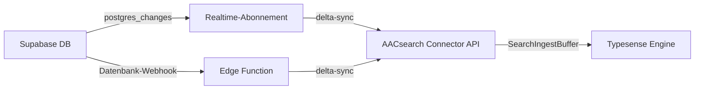

# Supabase-Synchronisations-Connector

Der Supabase-Synchronisations-Connector hält Ihre AACsearch-Indizes in Echtzeit mit Ihrer Supabase-Datenbank synchron. Er unterstützt zwei Bereitstellungsansätze:

## Ansatz 1: Node.js Realtime-Abonnement (empfohlen)

Ein Node.js-Prozess abonniert Supabase Realtime `postgres_changes`-Ereignisse und überträgt zeilenweise Änderungen (INSERT / UPDATE / DELETE) an die AACsearch Connector API.

### Installation

```bash
npm install @aacsearch/supabase-sync
```

### Verwendung

Erstellen Sie einen Synchronisationsprozess (z. B. `sync.ts`):

```typescript
import { createRealtimeSubscription } from "@aacsearch/supabase-sync";

const rtClient = createRealtimeSubscription({
	aacsearch: {
		baseUrl: process.env.AACSEARCH_URL!,
		token: process.env.AACSEARCH_TOKEN!,
		projectId: process.env.AACSEARCH_PROJECT_ID!,
	},
	supabase: {
		url: process.env.SUPABASE_URL!,
		apiKey: process.env.SUPABASE_ANON_KEY!,
	},
	tables: [
		{ table: "products", idColumn: "id" },
		{ table: "categories", idColumn: "id", columns: ["name", "slug", "description"] },
		{
			table: "reviews",
			idColumn: "id",
			mapper: (row) => ({
				external_id: String(row.id),
				title: row.title,
				content: row.body,
				rating: row.stars,
				product_id: row.product_id,
			}),
		},
	],
	debug: true,
});

// Ordnungsgemäßes Herunterfahren
process.on("SIGTERM", () => {
	rtClient.disconnect();
	process.exit(0);
});
process.on("SIGINT", () => {
	rtClient.disconnect();
	process.exit(0);
});
```

Ausführen:

```bash
npx tsx sync.ts
```

Oder bereitstellen auf einem beliebigen Node.js-Hosting (Fly.io, Railway, Render usw.).

### Umgebungsvariablen

| Variable               | Beschreibung                                           |
| ---------------------- | ------------------------------------------------------ |
| `AACSEARCH_URL`        | AACsearch-API-URL (z. B. `https://api.aacsearch.com`)  |
| `AACSEARCH_TOKEN`      | Connector-Bearer-Token (`ss_connector_*`)              |
| `AACSEARCH_PROJECT_ID` | Ihre AACsearch-Projekt-ID                              |
| `SUPABASE_URL`         | Supabase-Projekt-URL (z. B. `https://xxx.supabase.co`) |
| `SUPABASE_ANON_KEY`    | Supabase-Anon- oder Service_Role-Key                   |

## Ansatz 2: Supabase Edge Function (serverlos)

Für einen Ansatz ohne Infrastruktur stellen Sie die Edge Function als Datenbank-Webhook bereit.

### Bereitstellen

```bash
# Kopieren Sie die Edge Function in Ihr Supabase-Projekt
cp -r node_modules/@aacsearch/supabase-sync/dist/edge-function \
  supabase/functions/aacsearch-sync

# Bereitstellen
supabase functions deploy aacsearch-sync --no-verify-jwt

# Geheimnisse setzen
supabase secrets set AACSEARCH_URL=https://api.aacsearch.com
supabase secrets set AACSEARCH_TOKEN=***
supabase secrets set AACSEARCH_PROJECT_ID=org_xxx
```

### Datenbank-Webhook konfigurieren

1. Öffnen Sie Ihr **Supabase-Dashboard** → **Datenbank** → **Webhooks**
2. Klicken Sie auf **Neuen Webhook erstellen**
3. Konfigurieren Sie:
    - **Name**: `aacsearch-sync`
    - **Tabelle**: Ihre Tabelle (z. B. `products`)
    - **Ereignisse**: INSERT, UPDATE, DELETE
    - **Typ**: HTTP-Anfrage
    - **HTTP-Methode**: POST
    - **URL**: `https://[project-ref].supabase.co/functions/v1/aacsearch-sync`
    - **HTTP-Header**: `Authorization: Bearer ***`
    - **Bedingung** (optional): z. B. nur auslösen, wenn `published = true`

Die Edge Function empfängt die Webhook-Nutzlast, erstellt ein AACsearch-Dokument
und überträgt es an `POST /api/projects/:projectId/sync/delta` oder
`DELETE /api/projects/:projectId/products/:externalId`.

## Funktionsweise



## Best Practices

1. **Verwenden Sie einen dedizierten Service_Role-Key** für das Realtime-Abonnement, um RLS zu umgehen
2. **Setzen Sie einen Filter** auf das Abonnement, um das Synchronisieren irrelevanter Zeilen zu vermeiden
3. **Verwenden Sie benutzerdefinierte Mapper**, um vertrauliche oder große Felder vor der Synchronisation zu transformieren
4. **Führen Sie regelmäßig eine vollständige Synchronisation** durch (`AacSearchClient.fullSync()`), um verpasste Änderungen zu erfassen
5. **Überwachen Sie Fehler** über den `onError`-Callback und richten Sie Benachrichtigungen ein
6. **Behandeln Sie Backfills**: Verwenden Sie für bereits vorhandene Daten einmal `fullSync()` und wechseln Sie dann zu Realtime

## Verwandte Themen

- [Connector-API-Referenz](./connector-api-lifecycle)
