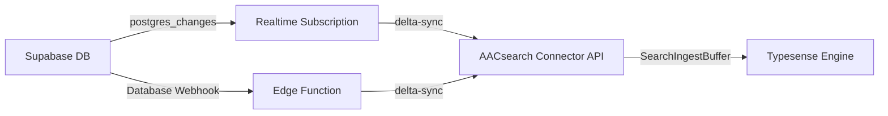

# Supabase Sync Connector

The Supabase Sync Connector keeps your AACsearch indexes in sync with your Supabase database in real-time. It supports two deployment approaches:

## Approach 1: Node.js Realtime Subscription (recommended)

A Node.js process subscribes to Supabase Realtime `postgres_changes` events and pushes row-level changes (INSERT / UPDATE / DELETE) to the AACsearch Connector API.

### Installation

```bash
npm install @aacsearch/supabase-sync
```

### Usage

Create a sync process (e.g. `sync.ts`):

```typescript
import { createRealtimeSubscription } from "@aacsearch/supabase-sync";

const rtClient = createRealtimeSubscription({
  aacsearch: {
    baseUrl: process.env.AACSEARCH_URL!,
    token: process.env.AACSEARCH_TOKEN!,
    projectId: process.env.AACSEARCH_PROJECT_ID!,
  },
  supabase: {
    url: process.env.SUPABASE_URL!,
    apiKey: process.env.SUPABASE_ANON_KEY!,
  },
  tables: [
    { table: "products", idColumn: "id" },
    { table: "categories", idColumn: "id", columns: ["name", "slug", "description"] },
    {
      table: "reviews",
      idColumn: "id",
      mapper: (row) => ({
        external_id: String(row.id),
        title: row.title,
        content: row.body,
        rating: row.stars,
        product_id: row.product_id,
      }),
    },
  ],
  debug: true,
});

// Handle graceful shutdown
process.on("SIGTERM", () => { rtClient.disconnect(); process.exit(0); });
process.on("SIGINT", () => { rtClient.disconnect(); process.exit(0); });
```

Run it:

```bash
npx tsx sync.ts
```

Or deploy to any Node.js hosting (Fly.io, Railway, Render, etc.).

### Environment variables

| Variable | Description |
|----------|-------------|
| `AACSEARCH_URL` | AACsearch API URL (e.g. `https://api.aacsearch.com`) |
| `AACSEARCH_TOKEN` | Connector bearer token (`ss_connector_*`) |
| `AACSEARCH_PROJECT_ID` | Your AACsearch project ID |
| `SUPABASE_URL` | Supabase project URL (e.g. `https://xxx.supabase.co`) |
| `SUPABASE_ANON_KEY` | Supabase anon or service_role key |

## Approach 2: Supabase Edge Function (serverless)

For a zero-infrastructure approach, deploy the Edge Function as a Database Webhook.

### Deploy

```bash
# Copy the Edge Function into your Supabase project
cp -r node_modules/@aacsearch/supabase-sync/dist/edge-function \
  supabase/functions/aacsearch-sync

# Deploy
supabase functions deploy aacsearch-sync --no-verify-jwt

# Set secrets
supabase secrets set AACSEARCH_URL=https://api.aacsearch.com
supabase secrets set AACSEARCH_TOKEN=ss_connector_xxx
supabase secrets set AACSEARCH_PROJECT_ID=org_xxx
```

### Configure Database Webhook

1. Open your **Supabase Dashboard** → **Database** → **Webhooks**
2. Click **Create a new webhook**
3. Configure:
   - **Name**: `aacsearch-sync`
   - **Table**: Your table (e.g. `products`)
   - **Events**: INSERT, UPDATE, DELETE
   - **Type**: HTTP Request
   - **HTTP Method**: POST
   - **URL**: `https://[project-ref].supabase.co/functions/v1/aacsearch-sync`
   - **HTTP Headers**: `Authorization: Bearer [anon-key]`
   - **Condition** (optional): e.g. only trigger when `published = true`

The Edge Function receives the webhook payload, builds an AACsearch document,
and pushes it to `POST /api/projects/:projectId/sync/delta` or
`DELETE /api/projects/:projectId/products/:externalId`.

## How it works



## Best practices

1. **Use a dedicated service_role key** for the Realtime subscription to bypass RLS
2. **Set a filter** on the subscription to avoid syncing irrelevant rows
3. **Use custom mappers** to transform confidential or large fields before syncing
4. **Run full sync** periodically (`AacSearchClient.fullSync()`) to catch missed changes
5. **Monitor errors** via the `onError` callback and set up alerting
6. **Handle backfills**: for existing data, use `fullSync()` once, then switch to Realtime

## Related

- [Connector API Reference](./connector-api-lifecycle)
