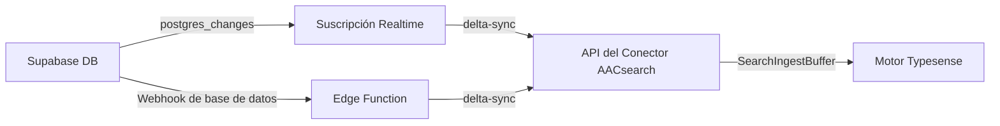

# Conector de Sincronización de Supabase

El conector de sincronización de Supabase mantiene sus índices de AACsearch sincronizados con su base de datos de Supabase en tiempo real. Soporta dos enfoques de implementación:

## Enfoque 1: Suscripción Realtime de Node.js (recomendada)

Un proceso de Node.js se suscribe a los eventos `postgres_changes` de Supabase Realtime y envía cambios a nivel de fila (INSERT / UPDATE / DELETE) a la API del Conector de AACsearch.

### Instalación

```bash
npm install @aacsearch/supabase-sync
```

### Uso

Cree un proceso de sincronización (ej. `sync.ts`):

```typescript
import { createRealtimeSubscription } from "@aacsearch/supabase-sync";

const rtClient = createRealtimeSubscription({
	aacsearch: {
		baseUrl: process.env.AACSEARCH_URL!,
		token: process.env.AACSEARCH_TOKEN!,
		projectId: process.env.AACSEARCH_PROJECT_ID!,
	},
	supabase: {
		url: process.env.SUPABASE_URL!,
		apiKey: process.env.SUPABASE_ANON_KEY!,
	},
	tables: [
		{ table: "products", idColumn: "id" },
		{ table: "categories", idColumn: "id", columns: ["name", "slug", "description"] },
		{
			table: "reviews",
			idColumn: "id",
			mapper: (row) => ({
				external_id: String(row.id),
				title: row.title,
				content: row.body,
				rating: row.stars,
				product_id: row.product_id,
			}),
		},
	],
	debug: true,
});

// Apagado graceful
process.on("SIGTERM", () => {
	rtClient.disconnect();
	process.exit(0);
});
process.on("SIGINT", () => {
	rtClient.disconnect();
	process.exit(0);
});
```

Ejecútelo:

```bash
npx tsx sync.ts
```

O despliéguelo en cualquier hosting de Node.js (Fly.io, Railway, Render, etc.).

### Variables de entorno

| Variable               | Descripción                                         |
| ---------------------- | --------------------------------------------------- |
| `AACSEARCH_URL`        | URL de la API de AACsearch (ej. `https://api.aacsearch.com`) |
| `AACSEARCH_TOKEN`      | Token de portador del conector (`ss_connector_*`)   |
| `AACSEARCH_PROJECT_ID` | ID de su proyecto AACsearch                         |
| `SUPABASE_URL`         | URL del proyecto Supabase (ej. `https://xxx.supabase.co`) |
| `SUPABASE_ANON_KEY`    | Clave anónima o service_role de Supabase            |

## Enfoque 2: Edge Function de Supabase (serverless)

Para un enfoque sin infraestructura, despliegue la Edge Function como un Webhook de base de datos.

### Despliegue

```bash
# Copie la Edge Function en su proyecto de Supabase
cp -r node_modules/@aacsearch/supabase-sync/dist/edge-function \
  supabase/functions/aacsearch-sync

# Despliegue
supabase functions deploy aacsearch-sync --no-verify-jwt

# Establezca secretos
supabase secrets set AACSEARCH_URL=https://api.aacsearch.com
supabase secrets set AACSEARCH_TOKEN=***
supabase secrets set AACSEARCH_PROJECT_ID=org_xxx
```

### Configurar Webhook de base de datos

1. Abra su **Panel de Supabase** → **Base de datos** → **Webhooks**
2. Haga clic en **Crear un nuevo webhook**
3. Configure:
    - **Nombre**: `aacsearch-sync`
    - **Tabla**: Su tabla (ej. `products`)
    - **Eventos**: INSERT, UPDATE, DELETE
    - **Tipo**: Solicitud HTTP
    - **Método HTTP**: POST
    - **URL**: `https://[project-ref].supabase.co/functions/v1/aacsearch-sync`
    - **Encabezados HTTP**: `Authorization: Bearer ***`
    - **Condición** (opcional): ej. solo activar cuando `published = true`

La Edge Function recibe la carga útil del webhook, construye un documento de AACsearch
y lo envía a `POST /api/projects/:projectId/sync/delta` o
`DELETE /api/projects/:projectId/products/:externalId`.

## Cómo funciona



## Mejores prácticas

1. **Use una clave service_role dedicada** para la suscripción Realtime para evitar RLS
2. **Establezca un filtro** en la suscripción para evitar sincronizar filas irrelevantes
3. **Use mapeadores personalizados** para transformar campos confidenciales o grandes antes de sincronizar
4. **Ejecute sincronización completa** periódicamente (`AacSearchClient.fullSync()`) para capturar cambios perdidos
5. **Monitoree errores** mediante el callback `onError` y configure alertas
6. **Maneje backfills**: para datos existentes, use `fullSync()` una vez, luego cambie a Realtime

## Relacionados

- [Referencia de la API del Conector](./connector-api-lifecycle)
