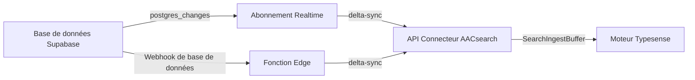

# Connecteur de synchronisation Supabase

Le connecteur de synchronisation Supabase maintient vos index AACsearch à jour avec votre base de données Supabase en temps réel. Il prend en charge deux approches de déploiement :

## Approche 1 : Abonnement Node.js Realtime (recommandée)

Un processus Node.js s'abonne aux événements `postgres_changes` de Supabase Realtime et envoie les modifications au niveau des lignes (INSERT / UPDATE / DELETE) à l'API Connecteur AACsearch.

### Installation

```bash
npm install @aacsearch/supabase-sync
```

### Utilisation

Créez un processus de synchronisation (par ex. `sync.ts`) :

```typescript
import { createRealtimeSubscription } from "@aacsearch/supabase-sync";

const rtClient = createRealtimeSubscription({
	aacsearch: {
		baseUrl: process.env.AACSEARCH_URL!,
		token: process.env.AACSEARCH_TOKEN!,
		projectId: process.env.AACSEARCH_PROJECT_ID!,
	},
	supabase: {
		url: process.env.SUPABASE_URL!,
		apiKey: process.env.SUPABASE_ANON_KEY!,
	},
	tables: [
		{ table: "products", idColumn: "id" },
		{ table: "categories", idColumn: "id", columns: ["name", "slug", "description"] },
		{
			table: "reviews",
			idColumn: "id",
			mapper: (row) => ({
				external_id: String(row.id),
				title: row.title,
				content: row.body,
				rating: row.stars,
				product_id: row.product_id,
			}),
		},
	],
	debug: true,
});

// Arrêt gracieux
process.on("SIGTERM", () => {
	rtClient.disconnect();
	process.exit(0);
});
process.on("SIGINT", () => {
	rtClient.disconnect();
	process.exit(0);
});
```

Exécutez-le :

```bash
npx tsx sync.ts
```

Ou déployez sur n'importe quel hébergement Node.js (Fly.io, Railway, Render, etc.).

### Variables d'environnement

| Variable               | Description                                              |
| ---------------------- | -------------------------------------------------------- |
| `AACSEARCH_URL`        | URL de l'API AACsearch (ex. `https://api.aacsearch.com`) |
| `AACSEARCH_TOKEN`      | Jeton porteur du connecteur (`ss_connector_*`)           |
| `AACSEARCH_PROJECT_ID` | Votre ID de projet AACsearch                             |
| `SUPABASE_URL`         | URL du projet Supabase (ex. `https://xxx.supabase.co`)   |
| `SUPABASE_ANON_KEY`    | Clé anon ou service_role Supabase                        |

## Approche 2 : Fonction Edge Supabase (serverless)

Pour une approche sans infrastructure, déployez la Fonction Edge en tant que Webhook de base de données.

### Déploiement

```bash
# Copiez la Fonction Edge dans votre projet Supabase
cp -r node_modules/@aacsearch/supabase-sync/dist/edge-function \
  supabase/functions/aacsearch-sync

# Déployez
supabase functions deploy aacsearch-sync --no-verify-jwt

# Définissez les secrets
supabase secrets set AACSEARCH_URL=https://api.aacsearch.com
supabase secrets set AACSEARCH_TOKEN=***
supabase secrets set AACSEARCH_PROJECT_ID=org_xxx
```

### Configurer le Webhook de base de données

1. Ouvrez votre **Tableau de bord Supabase** → **Base de données** → **Webhooks**
2. Cliquez sur **Créer un nouveau webhook**
3. Configurez :
    - **Nom** : `aacsearch-sync`
    - **Table** : Votre table (ex. `products`)
    - **Événements** : INSERT, UPDATE, DELETE
    - **Type** : Requête HTTP
    - **Méthode HTTP** : POST
    - **URL** : `https://[project-ref].supabase.co/functions/v1/aacsearch-sync`
    - **En-têtes HTTP** : `Authorization: Bearer ***`
    - **Condition** (facultative) : par ex. déclencher uniquement quand `published = true`

La Fonction Edge reçoit la charge utile du webhook, construit un document AACsearch,
et l'envoie à `POST /api/projects/:projectId/sync/delta` ou
`DELETE /api/projects/:projectId/products/:externalId`.

## Fonctionnement



## Bonnes pratiques

1. **Utilisez une clé service_role dédiée** pour l'abonnement Realtime afin de contourner la RLS
2. **Définissez un filtre** sur l'abonnement pour éviter de synchroniser les lignes non pertinentes
3. **Utilisez des mappeurs personnalisés** pour transformer les champs confidentiels ou volumineux avant la synchronisation
4. **Exécutez une synchronisation complète** périodiquement (`AacSearchClient.fullSync()`) pour rattraper les modifications manquées
5. **Surveillez les erreurs** via le rappel `onError` et configurez des alertes
6. **Gérez les backfills** : pour les données existantes, utilisez `fullSync()` une fois, puis passez à Realtime

## Liens connexes

- [Référence de l'API Connecteur](./connector-api-lifecycle)
