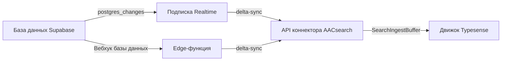

# Коннектор синхронизации Supabase

Коннектор синхронизации Supabase поддерживает актуальность индексов AACsearch в соответствии с вашей базой данных Supabase в реальном времени. Он поддерживает два подхода к развертыванию:

## Подход 1: Подписка Node.js Realtime (рекомендуется)

Процесс Node.js подписывается на события `postgres_changes` Supabase Realtime и отправляет изменения на уровне строк (INSERT / UPDATE / DELETE) в API коннектора AACsearch.

### Установка

```bash
npm install @aacsearch/supabase-sync
```

### Использование

Создайте процесс синхронизации (например, `sync.ts`):

```typescript
import { createRealtimeSubscription } from "@aacsearch/supabase-sync";

const rtClient = createRealtimeSubscription({
	aacsearch: {
		baseUrl: process.env.AACSEARCH_URL!,
		token: process.env.AACSEARCH_TOKEN!,
		projectId: process.env.AACSEARCH_PROJECT_ID!,
	},
	supabase: {
		url: process.env.SUPABASE_URL!,
		apiKey: process.env.SUPABASE_ANON_KEY!,
	},
	tables: [
		{ table: "products", idColumn: "id" },
		{ table: "categories", idColumn: "id", columns: ["name", "slug", "description"] },
		{
			table: "reviews",
			idColumn: "id",
			mapper: (row) => ({
				external_id: String(row.id),
				title: row.title,
				content: row.body,
				rating: row.stars,
				product_id: row.product_id,
			}),
		},
	],
	debug: true,
});

// Корректное завершение работы
process.on("SIGTERM", () => {
	rtClient.disconnect();
	process.exit(0);
});
process.on("SIGINT", () => {
	rtClient.disconnect();
	process.exit(0);
});
```

Запустите:

```bash
npx tsx sync.ts
```

Или разверните на любом Node.js хостинге (Fly.io, Railway, Render и т.д.).

### Переменные окружения

| Переменная             | Описание                                               |
| ---------------------- | ------------------------------------------------------ |
| `AACSEARCH_URL`        | URL API AACsearch (напр. `https://api.aacsearch.com`)  |
| `AACSEARCH_TOKEN`      | Bearer-токен коннектора (`ss_connector_*`)             |
| `AACSEARCH_PROJECT_ID` | ID вашего проекта AACsearch                            |
| `SUPABASE_URL`         | URL проекта Supabase (напр. `https://xxx.supabase.co`) |
| `SUPABASE_ANON_KEY`    | Анонимный ключ или ключ service_role Supabase          |

## Подход 2: Edge-функция Supabase (serverless)

Для подхода без инфраструктуры разверните Edge-функцию в качестве вебхука базы данных.

### Развертывание

```bash
# Скопируйте Edge-функцию в ваш проект Supabase
cp -r node_modules/@aacsearch/supabase-sync/dist/edge-function \
  supabase/functions/aacsearch-sync

# Разверните
supabase functions deploy aacsearch-sync --no-verify-jwt

# Установите секреты
supabase secrets set AACSEARCH_URL=https://api.aacsearch.com
supabase secrets set AACSEARCH_TOKEN=***
supabase secrets set AACSEARCH_PROJECT_ID=org_xxx
```

### Настройка вебхука базы данных

1. Откройте **Панель управления Supabase** → **База данных** → **Вебхуки**
2. Нажмите **Создать новый вебхук**
3. Настройте:
    - **Название**: `aacsearch-sync`
    - **Таблица**: Ваша таблица (напр. `products`)
    - **События**: INSERT, UPDATE, DELETE
    - **Тип**: HTTP-запрос
    - **HTTP-метод**: POST
    - **URL**: `https://[project-ref].supabase.co/functions/v1/aacsearch-sync`
    - **HTTP-заголовки**: `Authorization: Bearer ***`
    - **Условие** (необязательно): например, срабатывать только когда `published = true`

Edge-функция получает полезную нагрузку вебхука, создаёт документ AACsearch
и отправляет его в `POST /api/projects/:projectId/sync/delta` или
`DELETE /api/projects/:projectId/products/:externalId`.

## Как это работает



## Лучшие практики

1. **Используйте выделенный ключ service_role** для подписки Realtime, чтобы обойти RLS
2. **Установите фильтр** на подписку, чтобы избежать синхронизации ненужных строк
3. **Используйте пользовательские преобразователи** для трансформации конфиденциальных или больших полей перед синхронизацией
4. **Выполняйте полную синхронизацию** периодически (`AacSearchClient.fullSync()`) для обнаружения пропущенных изменений
5. **Отслеживайте ошибки** через обратный вызов `onError` и настройте оповещения
6. **Обрабатывайте обратные загрузки**: для существующих данных используйте `fullSync()` один раз, затем переключайтесь на Realtime

## Связанные материалы

- [Справочник API коннектора](./connector-api-lifecycle)
