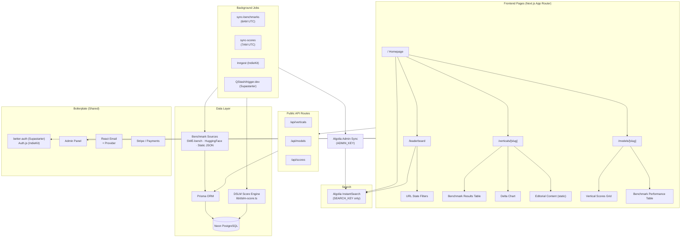

# DSLMRank.com — Cursor Agent Build Plan v2 (Boilerplate Edition)

## Phase 0 — Boilerplate Decision (Read Before Running Any Prompts)

Before running a single Cursor agent prompt, choose your boilerplate. The plan below is written with **decision forks** at every relevant step so the agent knows which path to take based on your choice. Both options produce the same DSLMRank feature set; they differ in what's pre-built vs what must be added.

### Boilerplate Comparison

| Dimension | Supastarter ($299–$349) | IndieKit ($79–$119) |
|---|---|---|
| **Framework** | Next.js App Router + Turborepo monorepo[^1] | Next.js 16 App Router, single repo[^2] |
| **Auth** | better-auth (email, magic link, OAuth, passkeys, 2FA)[^3] | Auth.js (social login, magic links, RBAC)[^4] |
| **ORM** | Prisma or Drizzle (your choice at setup)[^3] | Prisma + PostgreSQL[^5] |
| **Database** | Neon, Supabase, PlanetScale, Turso, Railway guides[^3] | Neon, PlanetScale, Supabase[^6] |
| **API Layer** | Hono + oRPC (type-safe, OpenAPI generation)[^1] | Next.js Route Handlers + AI SDK[^6] |
| **Payments** | 5 providers: Stripe, Lemon Squeezy, Creem, Polar, Dodo[^3] | 5 providers: Stripe, LemonSqueezy, Paddle, PayPal, Dodo[^2] |
| **Background Jobs** | trigger.dev, Upstash QStash, or BullMQ[^3] | Inngest[^6] |
| **Email** | React Email + Resend/Postmark/Plunk/Nodemailer[^3] | React Email + Resend/SES/Mailgun/Mailchimp[^6] |
| **Multi-tenancy** | Built-in organizations, roles, invite system[^3] | Built-in organizations, teams, RBAC[^4] |
| **AI SDK** | Vercel AI SDK (OpenAI, Anthropic, etc.)[^3] | AI SDK + Inngest multi-step workflows[^6] |
| **Cursor Rules** | Not native — add manually (Section 0B)[^1] | **Native** — built-in Cursor rules & Claude skills[^2] |
| **Monorepo** | Yes — Turborepo (apps/marketing, apps/saas, apps/docs)[^7] | No — single Next.js app[^2] |
| **i18n** | Built-in, English + German included[^3] | Not included[^2] |
| **Admin Panel** | Full super admin + user impersonation[^3] | Full admin dashboard + user impersonation[^6] |
| **Analytics** | 8+ providers pre-wired (PostHog, GA4, Mixpanel, etc.)[^3] | NextSEO + JSON-LD baked in[^6] |
| **Storage** | S3, R2, DigitalOcean Spaces, MinIO, Supabase Storage[^3] | Not included by default[^2] |
| **Docs App** | Fumadocs-powered docs site included[^3] | Not included[^2] |
| **Price** | $299 solo / $349 team — one-time[^7][^8] | $79–$119 — one-time + AppSumo LTD[^9][^2] |

### Recommendation for DSLMRank

**Use IndieKit** if: you want the fastest path to a running prototype, you're solo, and you want native Cursor/Windsurf rules so the agent has zero onboarding friction. The Inngest integration is particularly valuable for the benchmark sync cron jobs.[^2][^6][^10]

**Use Supastarter** if: you plan to eventually add a separate marketing site, documentation, or a second app (e.g., an Aikix integration layer), and you want the cleaner Turborepo monorepo to scale into. The oRPC API layer also maps cleanly to DSLMRank's public API design.[^7][^3][^1]

**DSLMRank recommendation: IndieKit** — the native Cursor rules, Inngest for cron/background jobs, and single-repo simplicity align better with a fast-moving intelligence platform that's being built by a solo agent run.

***

## Phase 0A — Pre-Flight Checklist (Run Before Any Prompts)

Complete these steps manually before pasting any agent prompts:

**For Supastarter:**
1. Purchase at [supastarter.dev](https://supastarter.dev) (~$299)
2. Clone the Next.js repo from your license download
3. Run `npm install` in the monorepo root
4. Create Neon PostgreSQL database at [neon.tech](https://neon.tech) — copy the TCP `postgres://` connection string
5. Create Algolia account at [algolia.com](https://algolia.com) — note App ID, Search Key, Admin Key
6. Copy `.env.example` → `.env.local` and fill in DATABASE_URL, better-auth secrets
7. Run `npx prisma generate && npx prisma db push`
8. Confirm `npm run dev` runs cleanly

**For IndieKit:**
1. Purchase at [indiekit.pro](https://indiekit.pro) (~$79–$119)[^2]
2. Clone the repo
3. Run `npm install`
4. Create Neon PostgreSQL database — copy `postgres://` TCP connection string
5. Create Algolia account — note App ID, Search Key, Admin Key
6. Copy `.env.example` → `.env.local` and fill in DATABASE_URL, AUTH_SECRET, NEXTAUTH_URL
7. Run `npx prisma generate && npx prisma db push`
8. Confirm `npm run dev` runs cleanly
9. **IndieKit bonus:** Review the built-in Cursor rules in `.cursor/` — note the existing `db-handler`, `auth-handler`, `payments-handler` skills which the agent will build on[^6]

***

## Phase 0B — Master Cursor Rules File

Create this file **first** before all other prompts. It extends the boilerplate's existing rules (IndieKit) or establishes them from scratch (Supastarter).

### `.cursor/rules/dslmrank.mdc`

```markdown
---
description: DSLMRank.com project-specific rules — always apply alongside boilerplate rules
alwaysApply: true
---

# DSLMRank Project Rules

## Project Identity
DSLMRank.com is a public intelligence platform ranking Domain-Specific Language Models (DSLMs)
by industry vertical performance. It uses a proprietary DSLM Score (0-100) per model×vertical pair.

## BOILERPLATE: [SUPASTARTER | INDIEKIT]
<!-- IMPORTANT: Replace the bracketed value above with your chosen boilerplate -->
<!-- This changes which auth, job, and API patterns the agent uses below -->

## Stack Additions to Boilerplate
- algoliasearch + react-instantsearch (search layer)
- @tanstack/react-query (already in Supastarter; add for IndieKit)
- date-fns (date formatting)
- zod (validation — likely already present)
- cheerio (HTML scraping for benchmark data sources)
- node-fetch or native fetch (benchmark ingestion HTTP calls)

## DSLMRank Domain Rules

### DSLM Score Engine (lib/dslm-score.ts)
- NEVER compute scores inline in components — always call lib/dslm-score.ts functions
- Score formula: benchmark(40%) + delta(30%) + adoption(20%) + compliance(10%)
- All scores stored as 0-100 Float in DslmScore table
- Delta = (model_avg - best_gplm_avg) / best_gplm_avg * 100, clamped [-50, +100], normalized [0,100]

### Prisma Schema Extensions
- All DSLMRank-specific models extend the boilerplate schema — never modify boilerplate auth models
- New models: Vertical, LlmModel, Benchmark, BenchmarkResult, DslmScore, ModelVertical
- Use @default(cuid()) for all new model IDs
- Use @@unique for composite unique constraints on BenchmarkResult and DslmScore

### Background Jobs / Cron
<!-- SUPASTARTER: Use trigger.dev or Upstash QStash -->
<!-- INDIEKIT: Use Inngest (already wired in) -->
- Daily sync at 6AM UTC: sync-benchmarks → sync-scores → algolia-index
- Each job must be independently retriable (no monolithic sync function)
- All cron endpoints require CRON_SECRET Bearer auth or platform-specific cron auth header

### API Routes
- All public read APIs live in app/api/ with Cache-Control: s-maxage=3600
- Validate all query params with Zod before hitting Prisma
- Return { error: string, status: number } shape for all error responses
- NEVER expose admin keys or CRON_SECRET in client-side code

### UI Conventions
- Loading states: ALWAYS use Skeleton component for async data — no spinners
- Leaderboard table: horizontal scroll on mobile, hide Delta + Adoption columns below md breakpoint
- Vertical pages use generateStaticParams + export const revalidate = 3600
- Dark mode first — all new components must work in dark mode

### Algolia
- Frontend ALWAYS uses ALGOLIA_SEARCH_KEY (read-only)
- ALGOLIA_ADMIN_KEY only in server-side sync functions
- Index names: "dslmrank_models" and "dslmrank_verticals"

## Commands
- npm run dev — start dev server
- npm run typecheck — run after every feature (mandatory)
- npx prisma generate — after schema changes
- npx prisma db push — push schema to Neon
- npm run seed — run prisma/seed.ts
```

***

## Phase 1 — Schema Extension

### Prompt 1.1 — Add DSLMRank Models to Prisma Schema

> **Note to agent:** Do NOT modify any existing boilerplate auth models (User, Account, Session, Organization, etc.). Only append new models below the existing schema.

```
Extend the existing Prisma schema at prisma/schema.prisma with DSLMRank-specific models.
DO NOT touch or modify any existing boilerplate models.
Append these models at the end of the schema file:

model Vertical {
  id          String   @id @default(cuid())
  name        String   @unique
  slug        String   @unique
  description String
  icon        String
  tier        Int      // 1=Tier1 critical, 2=Tier2 emerging, 3=Tier3 watchlist
  createdAt   DateTime @default(now())
  updatedAt   DateTime @updatedAt
  benchmarks  Benchmark[]
  scores      DslmScore[]
  models      ModelVertical[]
}

model LlmModel {
  id              String   @id @default(cuid())
  name            String   @unique
  slug            String   @unique
  provider        String
  type            String   // "general" | "domain-specific"
  description     String
  contextWindow   Int?
  inputCostPer1M  Float?
  outputCostPer1M Float?
  isOpenSource    Boolean  @default(false)
  isMultimodal    Boolean  @default(false)
  officialUrl     String?
  logoUrl         String?
  createdAt       DateTime @default(now())
  updatedAt       DateTime @updatedAt
  scores          DslmScore[]
  benchmarkResults BenchmarkResult[]
  verticals       ModelVertical[]
}

model ModelVertical {
  id              String   @id @default(cuid())
  model           LlmModel @relation(fields: [modelId], references: [id])
  modelId         String
  vertical        Vertical @relation(fields: [verticalId], references: [id])
  verticalId      String
  rank            Int?
  adoptionSignal  Float?
  @@unique([modelId, verticalId])
}

model Benchmark {
  id          String   @id @default(cuid())
  name        String   @unique
  slug        String   @unique
  description String
  vertical    Vertical @relation(fields: [verticalId], references: [id])
  verticalId  String
  sourceUrl   String
  methodology String
  createdAt   DateTime @default(now())
  results     BenchmarkResult[]
}

model BenchmarkResult {
  id          String    @id @default(cuid())
  benchmark   Benchmark @relation(fields: [benchmarkId], references: [id])
  benchmarkId String
  model       LlmModel  @relation(fields: [modelId], references: [id])
  modelId     String
  score       Float
  rawScore    Float?
  rawUnit     String?
  measuredAt  DateTime
  sourceUrl   String?
  createdAt   DateTime  @default(now())
  @@unique([benchmarkId, modelId, measuredAt])
}

model DslmScore {
  id          String   @id @default(cuid())
  model       LlmModel @relation(fields: [modelId], references: [id])
  modelId     String
  vertical    Vertical @relation(fields: [verticalId], references: [id])
  verticalId  String
  score       Float
  delta       Float?
  rank        Int
  computedAt  DateTime @default(now())
  @@unique([modelId, verticalId, computedAt])
}

After adding models:
1. Run: npx prisma generate
2. Run: npx prisma db push
3. Run: npm run typecheck
Report any errors.
```

***

### Prompt 1.2 — Seed Data

```
Create prisma/seed.ts and seed DSLMRank with the following data.
Import Prisma client from the correct generated path for this boilerplate.
Use upsert (not create) for all records so the seed is re-runnable.

VERTICALS (15 total):

Tier 1:
{ name: "Healthcare / Life Sciences", slug: "healthcare", icon: "Heart", tier: 1, description: "Clinical decision support, medical imaging, diagnostics, and life sciences research." }
{ name: "Finance / FinTech", slug: "finance", icon: "TrendingUp", tier: 1, description: "Risk modeling, earnings analysis, regulatory compliance, and financial document processing." }
{ name: "Legal / Compliance", slug: "legal", icon: "Scale", tier: 1, description: "Contract review, legal research, e-discovery, and regulatory compliance automation." }
{ name: "Software Engineering", slug: "software-engineering", icon: "Code2", tier: 1, description: "Code generation, debugging, architecture review, and automated pull request analysis." }
{ name: "Cybersecurity", slug: "cybersecurity", icon: "Shield", tier: 1, description: "Threat analysis, vulnerability detection, incident response, and compliance auditing." }

Tier 2:
{ name: "Retail / E-Commerce", slug: "retail", icon: "ShoppingCart", tier: 2, description: "Product recommendations, inventory optimization, and customer service automation." }
{ name: "Manufacturing / Industrial", slug: "manufacturing", icon: "Factory", tier: 2, description: "Predictive maintenance, quality control, and supply chain optimization." }
{ name: "Sales & GTM", slug: "sales-gtm", icon: "Target", tier: 2, description: "Lead scoring, outreach personalization, and pipeline analysis for B2B revenue teams." }
{ name: "Education / EdTech", slug: "education", icon: "GraduationCap", tier: 2, description: "Curriculum design, adaptive tutoring, and student outcome assessment." }
{ name: "Energy & Sustainability", slug: "energy", icon: "Zap", tier: 2, description: "Emissions compliance, asset management, and energy efficiency optimization." }
{ name: "Agriculture / AgTech", slug: "agriculture", icon: "Leaf", tier: 2, description: "Crop yield forecasting, pest detection, and precision agriculture analytics." }
{ name: "HR / Workforce", slug: "hr-workforce", icon: "Users", tier: 2, description: "Benefits administration, policy compliance, and talent acquisition automation." }

Tier 3:
{ name: "Agentic AI Infrastructure", slug: "agentic-ai", icon: "Bot", tier: 3, description: "Autonomous agent frameworks, tool-use orchestration, and multi-agent coordination." }
{ name: "Multimodal Systems", slug: "multimodal", icon: "Layers", tier: 3, description: "Combined text, image, audio, and video understanding for enterprise workflows." }
{ name: "Edge / TinyML", slug: "edge-tinyml", icon: "Cpu", tier: 3, description: "Compressed models for local inference, IoT, and privacy-sensitive edge deployments." }

LLM MODELS (seed these):
- { name: "GPT-4.1", slug: "gpt-4-1", provider: "OpenAI", type: "general", contextWindow: 1000000, officialUrl: "https://openai.com" }
- { name: "o3", slug: "o3", provider: "OpenAI", type: "general", description: "Reasoning-specialized model" }
- { name: "Claude Opus 4.5", slug: "claude-opus-4-5", provider: "Anthropic", type: "general", contextWindow: 200000, officialUrl: "https://anthropic.com" }
- { name: "Claude Sonnet 4.5", slug: "claude-sonnet-4-5", provider: "Anthropic", type: "general", contextWindow: 200000 }
- { name: "Gemini 2.5 Pro", slug: "gemini-2-5-pro", provider: "Google", type: "general", contextWindow: 1000000, isMultimodal: true }
- { name: "Llama 4 Maverick", slug: "llama-4-maverick", provider: "Meta", type: "general", isOpenSource: true, contextWindow: 10000000 }
- { name: "Mistral Large 3", slug: "mistral-large-3", provider: "Mistral AI", type: "general", isOpenSource: true }
- { name: "BloombergGPT", slug: "bloomberggpt", provider: "Bloomberg", type: "domain-specific", description: "Finance-specialized LLM trained on Bloomberg's proprietary financial data corpus." }
- { name: "Palmyra-Fin", slug: "palmyra-fin", provider: "Writer", type: "domain-specific", description: "Finance-specialized model achieving 73% on CFA Level III vs GPT-4's 33%." }
- { name: "Med-PaLM 2", slug: "med-palm-2", provider: "Google", type: "domain-specific", description: "Healthcare-specialized model scoring 86.5% on MedQA benchmark." }
- { name: "BioGPT", slug: "biogpt", provider: "Microsoft", type: "domain-specific", isOpenSource: true }
- { name: "ChatLAW", slug: "chatlaw", provider: "Tsinghua University", type: "domain-specific", isOpenSource: true }
- { name: "Codestral", slug: "codestral", provider: "Mistral AI", type: "domain-specific", description: "Code-specialized model optimized for 80+ programming languages." }
- { name: "DeepSeek-Coder V3", slug: "deepseek-coder-v3", provider: "DeepSeek", type: "domain-specific", isOpenSource: true }

BENCHMARKS (seed these with verticalSlug association):
| slug | name | verticalSlug | sourceUrl |
|------|------|-------------|-----------|
| medqa | MedQA | healthcare | https://arxiv.org/abs/2009.13081 |
| medmcqa | MedMCQA | healthcare | https://medmcqa.github.io |
| multimedqa | MultiMedQA | healthcare | https://arxiv.org/abs/2212.13138 |
| financebench | FinanceBench | finance | https://financebench.ai |
| finben | FinBen | finance | https://github.com/The-FinAI/PIXIU |
| cfa-level-iii | CFA Level III | finance | https://www.cfainstitute.org |
| legalbench | LegalBench | legal | https://hazyresearch.stanford.edu/legalbench |
| casehold | CaseHOLD | legal | https://arxiv.org/abs/2104.08671 |
| swe-bench-verified | SWE-bench Verified | software-engineering | https://www.swebench.com |
| livecodebench | LiveCodeBench | software-engineering | https://livecodebench.github.io |
| humaneval | HumanEval | software-engineering | https://github.com/openai/human-eval |
| cybermetric | CyberMetric | cybersecurity | https://arxiv.org/abs/2402.07688 |

STATIC BENCHMARK RESULTS (seed from published research — use upsert):
- Palmyra-Fin on CFA Level III: rawScore=73.0, score=73.0, sourceUrl="https://writer.com/research/palmyra-fin"
- GPT-4 on CFA Level III: rawScore=33.0, score=33.0, sourceUrl="https://writer.com/research/palmyra-fin"
- Med-PaLM 2 on MedQA: rawScore=86.5, score=86.5, sourceUrl="https://arxiv.org/abs/2305.09617"
Use measuredAt: new Date("2024-01-01") for static entries.

After creating seed.ts:
1. Add "seed": "ts-node --compiler-options {\"module\":\"CommonJS\"} prisma/seed.ts" to package.json scripts
2. Run the seed
3. Verify record counts with: npx prisma studio (report what you see)
```

***

## Phase 2 — DSLM Score Engine

### Prompt 2.1 — Score Computation Library

```
Create lib/dslm-score.ts — the proprietary DSLM Score engine for DSLMRank.

Import Prisma client from the boilerplate's existing prisma.ts lib file (do NOT create a new one).

FORMULA:
DSLM_Score = (benchmark_score × 0.40) + (delta_normalized × 0.30) + (adoption_signal × 0.20) + (compliance_score × 0.10)

COMPONENT DEFINITIONS:

1. benchmark_score (0-100):
   Mean of all BenchmarkResult.score values for this (modelId, verticalId) pair.
   If no benchmark results exist for this pair, skip — do not create a DslmScore.

2. delta_normalized (0-100):
   a. Get avg benchmark score for this model on this vertical
   b. Get avg benchmark score for the BEST general-purpose model (type="general") on this vertical
   c. delta_raw = (model_avg - best_gplm_avg) / Math.abs(best_gplm_avg) * 100
   d. Clamp delta_raw to [-50, +100]
   e. Normalize: delta_normalized = (delta_raw + 50) / 150 * 100

3. adoption_signal (0-100):
   Pull ModelVertical.adoptionSignal where modelId+verticalId match. Default 50 if null.

4. compliance_score (0-100):
   Base: 60
   +10 if provider in ["Anthropic", "OpenAI", "Google", "Microsoft"]
   +10 if contextWindow >= 100000
   -15 if isOpenSource === true (harder to certify in regulated verticals)
   Clamp to [0, 100]

EXPORTS:
- computeDslmScore(modelId: string, verticalId: string): Promise<number | null>
  Returns null if no benchmark data exists for the pair.

- getDslmDelta(modelId: string, verticalId: string): Promise<number>
  Returns the raw (unclamped) delta vs best GPLM on this vertical.

- computeAllScores(): Promise<{ computed: number; skipped: number }>
  Iterates all LlmModel × Vertical combinations where BenchmarkResult data exists.
  Upserts DslmScore records. Updates ModelVertical.rank for each vertical.
  Returns count of computed and skipped pairs.

Run typecheck after creation.
```

***

## Phase 3 — Background Jobs (Boilerplate-Specific Fork)

### Prompt 3.1A — Cron Jobs (IndieKit / Inngest path)

> **Use this prompt if you chose IndieKit.**

```
Create DSLMRank background jobs using Inngest (already installed in the boilerplate).

Create inngest/functions/sync-benchmarks.ts:
- Function ID: "dslmrank/sync-benchmarks"
- Trigger: cron "0 6 * * *" (6AM UTC daily)
- Step 1: Fetch SWE-bench leaderboard HTML from https://www.swebench.com and parse model names + resolved % scores using cheerio
- Step 2: Fetch HumanEval results from HuggingFace datasets API: GET https://huggingface.co/api/datasets/open-llm-leaderboard/results — extract model + HumanEval score
- Step 3: Load static overrides from data/benchmark-overrides.json
- Step 4: For each result, fuzzy-match modelName to LlmModel.name (case-insensitive, strip version suffixes), skip unmatched
- Step 5: Upsert BenchmarkResult records (normalize all raw scores to 0-100 range)
- Return { synced: number, errors: string[] }

Create inngest/functions/sync-scores.ts:
- Function ID: "dslmrank/sync-scores"
- Trigger: cron "0 7 * * *" (7AM UTC daily, runs after sync-benchmarks)
- Step 1: Call computeAllScores() from lib/dslm-score.ts
- Step 2: Sync updated models + verticals to Algolia (call lib/algolia-sync.ts)
- Return { computed: number }

Create data/benchmark-overrides.json with known research paper values:
[
  { "benchmarkSlug": "cfa-level-iii", "modelName": "Palmyra-Fin", "rawScore": 73.0, "unit": "%", "sourceUrl": "https://writer.com/research/palmyra-fin", "measuredAt": "2024-01-01" },
  { "benchmarkSlug": "cfa-level-iii", "modelName": "GPT-4", "rawScore": 33.0, "unit": "%", "sourceUrl": "https://writer.com/research/palmyra-fin", "measuredAt": "2024-01-01" },
  { "benchmarkSlug": "medqa", "modelName": "Med-PaLM 2", "rawScore": 86.5, "unit": "%", "sourceUrl": "https://arxiv.org/abs/2305.09617", "measuredAt": "2024-01-01" },
  { "benchmarkSlug": "swe-bench-verified", "modelName": "Claude Sonnet 4.5", "rawScore": 70.3, "unit": "%", "sourceUrl": "https://www.swebench.com", "measuredAt": "2025-12-01" },
  { "benchmarkSlug": "swe-bench-verified", "modelName": "GPT-4.1", "rawScore": 54.6, "unit": "%", "sourceUrl": "https://www.swebench.com", "measuredAt": "2025-12-01" }
]

Register both functions in inngest/index.ts alongside existing boilerplate functions.
Run typecheck after.
```

### Prompt 3.1B — Cron Jobs (Supastarter / trigger.dev or QStash path)

> **Use this prompt if you chose Supastarter.**

```
Create DSLMRank background jobs. Supastarter supports trigger.dev, Upstash QStash, or BullMQ.
We will use Upstash QStash as it requires the least infrastructure setup.

Install: npm install @upstash/qstash

Create app/api/jobs/sync-benchmarks/route.ts (POST endpoint):
- Verify Authorization: Bearer ${CRON_SECRET}
- Step 1: Fetch + parse SWE-bench HTML (cheerio)
- Step 2: Fetch HuggingFace HumanEval results
- Step 3: Load data/benchmark-overrides.json
- Step 4: Fuzzy-match and upsert BenchmarkResult records
- Return NextResponse.json({ synced: number, errors: string[] })

Create app/api/jobs/sync-scores/route.ts (POST endpoint):
- Verify CRON_SECRET
- Call computeAllScores()
- Call algolia sync
- Return NextResponse.json({ computed: number })

Create vercel.json in apps/saas/ (not root):
{
  "crons": [
    { "path": "/api/jobs/sync-benchmarks", "schedule": "0 6 * * *" },
    { "path": "/api/jobs/sync-scores", "schedule": "0 7 * * *" }
  ]
}

Create data/benchmark-overrides.json (same content as IndieKit path above).

Add to .env.local: CRON_SECRET=<generate 32-char random string>
Run typecheck after.
```

***

## Phase 4 — Algolia Search Layer

### Prompt 4.1 — Algolia Integration

```
Create lib/algolia-sync.ts for DSLMRank Algolia indexing.

Import algoliasearch using the existing ALGOLIA_APP_ID and ALGOLIA_ADMIN_KEY env vars.
If algoliasearch and react-instantsearch are not installed, install them now.

INDEX: "dslmrank_models"
Object shape per model:
{
  objectID: model.id,
  name: model.name,
  slug: model.slug,
  provider: model.provider,
  type: model.type,           // "general" | "domain-specific"
  isOpenSource: model.isOpenSource,
  topDslmScore: number | null,  // highest DslmScore.score across all verticals
  topVertical: string | null,   // slug of vertical with highest score
  verticals: string[],          // all vertical slugs this model has a DslmScore for
}

INDEX: "dslmrank_verticals"
Object shape per vertical:
{
  objectID: vertical.id,
  name: vertical.name,
  slug: vertical.slug,
  tier: vertical.tier,
  topModel: string | null,      // name of model with highest score in this vertical
  benchmarkCount: number,
}

Export:
- syncModelsToAlgolia(): Promise<void>
- syncVerticalsToAlgolia(): Promise<void>
- syncAllToAlgolia(): Promise<void> — calls both

Create components/shared/dslmrank-search.tsx (Client Component):
- Use InstantSearch from react-instantsearch with searchClient (ALGOLIA_SEARCH_KEY only — read-only)
- SearchBox (styled as shadcn Input, placeholder "Search models or verticals...")
- Hits dropdown panel below the input showing:
  - Model hits: name + provider badge + "DSLM Score: X" in top vertical
  - Vertical hits: vertical name + tier badge + "Top: [model name]"
- Keyboard: ↑↓ to navigate hits, Enter navigates to /models/[slug] or /verticals/[slug]
- Debounce 300ms, auto-close on blur or Escape
- Add to Navbar in the center position

Run typecheck after.
```

***

## Phase 5 — Core Pages

### Prompt 5.1 — Homepage

```
Build the DSLMRank homepage at app/page.tsx (or apps/marketing/app/page.tsx for Supastarter).

This is a Server Component. All data fetches go in the RSC, wrapped in Suspense.

SECTION 1 — Hero:
- Headline: "Which AI Model Wins Your Industry?"
- Sub-headline: "The only leaderboard that ranks LLMs by domain-specific performance — not just raw benchmarks."
- Two CTAs: "View Leaderboard" → /leaderboard, "Explore Verticals" → #verticals
- Animated stat strip below: "15 Verticals · 50+ Models · Live Benchmark Data · DSLM Score™"

SECTION 2 — What is a DSLM Score? (static explainer card, no data fetch)
- 2-column layout: left = explanation text, right = formula card showing the 4 components and weights

SECTION 3 — Tier 1 Verticals Grid (Suspense + Skeleton):
- Server fetch: all 5 Tier 1 verticals with their top DslmScore model
- 5-card grid (responsive: 1 col → 2 col → 5 col)
- Each card: Lucide icon + vertical name + top model name + top DSLM Score + "View Rankings" link

SECTION 4 — Top 10 Global Rankings (Suspense + Skeleton):
- Server fetch: top 10 DslmScore records across all verticals (sorted by score desc)
- Mini-table: Rank | Model | Vertical | DSLM Score | Delta badge
- "View Full Leaderboard" link below

SECTION 5 — Why Domain-Specific Matters (static):
- Side-by-side stat cards: "Palmyra-Fin: 73% on CFA Level III" vs "GPT-4: 33% on same test"
- Attribution note: source Writer Research

SECTION 6 — CTA Banner:
- "Tracking LLM Specialization, Vertical by Vertical"
- "Get notified when DSLM Scores update" → email signup (use boilerplate's waitlist/newsletter component if available, otherwise a simple form posting to /api/newsletter)

Run typecheck after.
```

***

### Prompt 5.2 — Leaderboard Page

```
Build the main leaderboard at app/leaderboard/page.tsx (or apps/saas/ for Supastarter).

SERVER COMPONENT with client filter components.

Create components/leaderboard/leaderboard-filters.tsx (Client Component):
- URL state via useSearchParams (no useState for filters)
- Filters: vertical (Combobox multi-select), model type (All/General/Domain-Specific toggle), provider (Select), tier (1/2/3/All toggle)
- "Clear Filters" button resets all URL params
- Filter changes trigger router.push() with updated search params

Create components/leaderboard/leaderboard-table.tsx (Server Component — receives filtered data):
Columns:
1. Rank (#) — large muted number
2. Model — name + provider badge (colored by provider) + open-source tag
3. Vertical — vertical name + tier indicator dot
4. DSLM Score — colored progress bar (red <40, yellow 40-70, green >70) + numeric score
5. Delta vs GPLM — "▲ +23.4%" in green or "▼ -5.1%" in red
6. Top Benchmark — benchmark name + normalized score
7. Adoption Signal — "High/Medium/Low" badge
8. — "View →" link button

Behavior:
- Sort: DSLM Score desc by default; clicking column headers adds ?sort= param
- Pagination: 25 per page, ?page= param
- Empty state: "No models match these filters — try adjusting your criteria"
- Loading: 8 Skeleton rows matching column layout

Create components/leaderboard/score-legend-card.tsx:
- Sidebar card explaining DSLM Score formula (4 components + weights)
- Collapsible on mobile

Overall layout: filters + legend on left sidebar (md+), table takes remaining width.
generateMetadata with SEO title/description.
Run typecheck after.
```

***

### Prompt 5.3 — Vertical Detail Pages

```
Build vertical detail pages at app/verticals/[slug]/page.tsx.

generateStaticParams: fetch all vertical slugs from DB.
export const revalidate = 3600

SERVER COMPONENT layout:

HERO:
- Vertical name, Lucide icon (from vertical.icon field), tier badge ("Tier 1 — Critical", "Tier 2 — Emerging", "Tier 3 — Watch")
- Description text
- 3 "podium" rank cards: #1, #2, #3 models by DslmScore in this vertical
  Each card: model name + provider + DSLM Score ring (SVG circle progress 0-100) + delta badge

BENCHMARK RESULTS TABLE (components/verticals/benchmark-results-table.tsx):
Server fetch: all BenchmarkResults for this vertical, joined with LlmModel + Benchmark
Columns: Model | Benchmark Name | Score | vs GPT-4.1 Delta | Date | Source (external link icon)
Sort by score desc. Group by benchmark name (collapsible sections).

DSLM DELTA VISUALIZATION (components/verticals/delta-chart.tsx):
Simple Tailwind div-based horizontal bar chart — NO external chart library.
Bars: one per model with a DslmScore for this vertical.
Bar color: green if delta > 0, amber if delta 0 to -10, red if delta < -10.
Labels: model name (left) + delta value (right).
Add a vertical line at 0 labeled "General LLM Baseline".

EDITORIAL CONTEXT SECTION:
Render from data/vertical-content.ts config (create this file).
Keys per vertical slug: why (string), compliance (string), trend (string), adoptionTip (string).
Pre-write content for all 15 verticals based on research:
- healthcare: HIPAA, FDA AI guidance, 25-30% performance uplift for rare disease diagnosis
- finance: FINRA/SOX compliance, Palmyra-Fin vs GPT-4 CFA score gap
- legal: LegalBench 162 task types, bar association ethics
- software-engineering: SWE-bench Verified as gold standard, agentic coding trend
- cybersecurity: MITRE ATT&CK alignment, zero-day detection
- [and for all 15 verticals]

RELATED VERTICALS: 3 cards linking to same-tier verticals.

generateMetadata: "Best LLMs for [Vertical Name] — DSLM Score Rankings | DSLMRank"
Run typecheck after.
```

***

### Prompt 5.4 — Model Detail Pages

```
Build model detail pages at app/models/[slug]/page.tsx.

generateStaticParams: all LlmModel slugs.
export const revalidate = 3600

SERVER COMPONENT:

HEADER:
- Model name (H1), provider, type badge, open-source badge, multimodal badge
- Spec row: Context Window | Input Cost (per 1M tokens) | Output Cost | Release approx.
- Official URL button (if set)

VERTICAL SCORES GRID (components/models/vertical-scores-grid.tsx):
- Grid 1→2→3 columns (mobile→tablet→desktop)
- One card per vertical where this model has a DslmScore
- Card: vertical icon + name, SVG circle DSLM Score gauge, rank in vertical ("#2 in Finance"), delta badge
- Sort by DslmScore desc
- Empty state: "No vertical scores yet — check back after next benchmark sync"

BENCHMARK PERFORMANCE TABLE:
All BenchmarkResults for this model, joined with Benchmark + Vertical
Columns: Benchmark | Vertical | Raw Score | Normalized (0-100) | vs Best in Vertical | Source link
Sort by normalized score desc.

STRENGTHS / WEAKNESSES:
Server-derive from DslmScore data:
- Top 3 verticals by DSLM Score → render as green "strength" pills: "✓ Finance (87.2)"
- Bottom 3 verticals by DSLM Score → render as red "weakness" pills: "✗ Agriculture (31.4)"
- Only show if model has 6+ vertical scores; otherwise show "Insufficient data across verticals"

generateMetadata: "[Model Name] DSLM Score Rankings Across All Industry Verticals | DSLMRank"
not-found.tsx: "Model not found — it may not be in our database yet."
Run typecheck after.
```

***

## Phase 6 — Public API Routes

### Prompt 6.1 — REST API

```
Create DSLMRank public read-only API routes.

All routes must:
- Use NextResponse.json()
- Add Cache-Control: s-maxage=3600, stale-while-revalidate=86400 header
- Validate query params with Zod (define schemas in lib/api-schemas.ts)
- Return { error: string } with appropriate HTTP status for failures

Create these routes:

GET /api/verticals
- Query: ?tier=1|2|3 (optional)
- Returns: { verticals: Array<Vertical & { topModel: { name, slug, topScore } | null, benchmarkCount: number }> }

GET /api/verticals/[slug]
- Returns: { vertical, scores: DslmScore[], benchmarkResults: BenchmarkResult[], topModels: LlmModel[] }
- 404 if slug not found

GET /api/models
- Query: ?type=general|domain-specific, ?provider=string
- Returns: { models: Array<LlmModel & { topScore: number | null, topVertical: string | null }> }

GET /api/models/[slug]
- Returns: { model, scores: DslmScore[], benchmarkResults: BenchmarkResult[] }

GET /api/scores
- Query: ?verticalSlug, ?modelType, ?provider, ?limit=50, ?offset=0
- Returns: { scores: Array<DslmScore & { model: LlmModel, vertical: Vertical }>, total: number }

GET /api/scores/[modelSlug]/[verticalSlug]
- Returns single DslmScore with all 4 component breakdowns (call getDslmDelta() for delta component)
- 404 if not found

Create lib/api-schemas.ts with Zod validation schemas for all query params.
Run typecheck after.
```

***

## Phase 7 — Admin Extensions

### Prompt 7.1 — Admin Panel Extensions

```
Extend the boilerplate's existing admin panel with DSLMRank-specific management screens.
The boilerplate already has an admin layout and user management — add these as new admin sections.

ROUTE: /admin/dslmrank/models
- Table: all LlmModel records with inline edit for: inputCostPer1M, outputCostPer1M, contextWindow, logoUrl, officialUrl, description
- Add new model dialog (shadcn Dialog with all LlmModel fields + Zod validation)
- Delete with confirmation dialog

ROUTE: /admin/dslmrank/benchmarks
- Table: Benchmark | Model | Score | Normalized | Vertical | Source | Date
- Manual entry form: add BenchmarkResult for any benchmark × model pair
- Delete individual results

ROUTE: /admin/dslmrank/adoption-signals
- Table of all ModelVertical records
- Inline edit adoptionSignal (0-100 slider) for each model×vertical pair
- Inline edit rank

ROUTE: /admin/dslmrank/sync
- "Sync Benchmarks" button → POST /api/jobs/sync-benchmarks (or trigger Inngest for IndieKit)
- "Recompute Scores" button → POST /api/jobs/sync-scores
- "Sync Algolia" button → POST server action calling syncAllToAlgolia()
- Display last sync timestamp from a simple SyncLog table (add to schema: model SyncLog { id, type, status, count, error, createdAt })
- After adding SyncLog to schema: npx prisma generate && npx prisma db push

Add SyncLog to Prisma schema before running this prompt.
Run typecheck after.
```

***

## Phase 8 — SEO & Static Assets

### Prompt 8.1 — SEO Infrastructure

```
Implement DSLMRank SEO infrastructure.

app/sitemap.ts (or apps/marketing/app/sitemap.ts for Supastarter):
- Static routes: /, /leaderboard, /about
- Dynamic: /verticals/[slug] for all vertical slugs (weekly changefreq, priority 0.8)
- Dynamic: /models/[slug] for all model slugs (daily changefreq, priority 0.7)
- Fetch slugs via Prisma at generation time

app/robots.ts: Allow all, point to sitemap.

Open Graph (update layout.tsx or root layout):
- metadataBase: new URL("https://dslmrank.com")
- Default OG: title, description, type: website, image: /og-default.png
- twitter: card: "summary_large_image"

Create public/og-default.png placeholder (simple 1200×630 image with text "DSLMRank — DSLM Score Rankings" — use a solid dark background with white text, generate with sharp or canvas if available, otherwise create a placeholder instructions file at public/og-instructions.txt explaining dimensions and content needed)

app/about/page.tsx (static):
Content sections:
1. "What is a DSLM Score?" — full 4-component methodology with weights
2. "What are Domain-Specific LLMs?" — DSLM vs GPLM explanation, cite Gartner 90% by 2030 forecast
3. "Data Sources" — table of all benchmarks with source links
4. "Update Frequency" — daily sync explanation
5. FAQ: How to submit a model, API access, data accuracy disclaimer

generateMetadata for /about.
Run typecheck after.
```

***

## Phase 9 — Final Audit & Launch

### Prompt 9.1 — Pre-Launch Audit

```
Run a complete pre-launch audit of DSLMRank.com. Fix all issues found.

LOADING STATES:
Audit every data-fetching component. Every async section must have:
- A Suspense boundary wrapping the Server Component
- A loading.tsx or inline Skeleton fallback that matches the content shape
Check: homepage vertical grid, top-10 table, leaderboard table, vertical benchmark table, model scores grid.

ERROR STATES:
- Confirm error.tsx exists for: app/, app/verticals/[slug]/, app/models/[slug]/, app/leaderboard/
- Confirm not-found.tsx exists for /verticals/[slug] and /models/[slug]

MOBILE:
- Leaderboard table: confirm horizontal scroll at < md breakpoint, confirm Delta and Adoption Signal columns are hidden below md
- Navigation: confirm search bar collapses to icon on mobile, hamburger works
- Model scores grid: confirm 1 col (mobile) → 2 col (tablet) → 3 col (desktop)

SECURITY:
- Grep entire codebase for ALGOLIA_ADMIN_KEY — must only appear in server-side files (lib/algolia-sync.ts, cron jobs)
- Grep for CRON_SECRET — must only appear in server-side route handlers
- Confirm no admin routes accessible without authenticated session + role=admin check

PERFORMANCE:
- Add export const revalidate = 3600 to: /leaderboard, /verticals/[slug], /models/[slug], homepage
- Confirm all images use next/image
- Confirm fonts use next/font

BUILD:
Run: npm run build
Fix ALL TypeScript and build errors before reporting back.
Report a list of every issue found and resolved.
```

***

## Architecture Diagram



***

## Boilerplate Delta Reference

This table shows what the boilerplate provides vs what DSLMRank-specific prompts above must build:

| Layer | Supastarter (built-in) | IndieKit (built-in) | DSLMRank Adds |
|---|---|---|---|
| Auth flows | ✅ better-auth | ✅ Auth.js | Admin role gate for /admin/dslmrank/* |
| Admin panel | ✅ super admin UI | ✅ admin dashboard | New sections: models, benchmarks, sync |
| DB schema | ✅ User/Org tables | ✅ User/Org tables | Vertical, LlmModel, Benchmark, etc. |
| Background jobs | ✅ trigger.dev / QStash | ✅ Inngest | sync-benchmarks, sync-scores functions |
| Email | ✅ React Email + provider | ✅ React Email + Resend | Newsletter CTA on homepage |
| Payments | ✅ Stripe + 4 others | ✅ Stripe + 4 others | Future: API access subscriptions |
| Cursor rules | ❌ manual setup | ✅ native skills (auth, db, payments) | dslmrank.mdc overlay (Phase 0B) |
| Monorepo | ✅ Turborepo | ❌ single app | N/A |
| i18n | ✅ full i18n | ❌ | N/A (not needed for MVP) |
| Marketing site | ✅ apps/marketing | ❌ | DSLMRank homepage in main app |
| Analytics | ✅ 8+ providers | ✅ NextSEO + JSON-LD | PostHog event tracking on score views |
| Search | ❌ | ❌ | Full Algolia layer (Phase 4) |
| DSLM Score engine | ❌ | ❌ | lib/dslm-score.ts (Phase 2) |
| Benchmark ingestion | ❌ | ❌ | Scrape + static JSON (Phase 3) |
| Leaderboard UI | ❌ | ❌ | All of Phase 5 |
| Vertical pages | ❌ | ❌ | Phase 5.3 |
| Public API | ❌ | ❌ | Phase 6 |

***

## Execution Order Summary

Run prompts in this exact sequence — each depends on the one before:

1. Phase 0A — Pre-flight (manual)
2. Phase 0B — `.cursor/rules/dslmrank.mdc`
3. Phase 1.1 — Schema extension
4. Phase 1.2 — Seed data
5. Phase 2.1 — DSLM Score engine
6. Phase 3.1A or 3.1B — Background jobs (pick your boilerplate path)
7. Phase 4.1 — Algolia
8. Phase 5.1 — Homepage
9. Phase 5.2 — Leaderboard
10. Phase 5.3 — Vertical pages
11. Phase 5.4 — Model pages
12. Phase 6.1 — Public API
13. Phase 7.1 — Admin extensions
14. Phase 8.1 — SEO
15. Phase 9.1 — Final audit + build

**Between every phase:** the agent must run `npm run typecheck` and resolve all errors before proceeding.

---

## References

1. [Tech Stack | Next.js Documentation - SaaS starter kit & boilerplate](https://supastarter.dev/docs/nextjs/tech-stack) - Learn about the tech stack used in supastarter. For a better understanding of the codebase, let's fi...

2. [Indie Kit - Next.js 16 SaaS Starter Kit](https://tailkits.com/tools/indie-kit/) - Get a clear look at Indie Kit, an AI-optimized Next.js 16 boilerplate with auth, payments, emails, S...

3. [Introduction | Next.js Documentation - SaaS starter kit & boilerplate](https://supastarter.dev/docs/nextjs) - What is supastarter? supastarter is a fullstack starter kit that helps you build production-ready an...

4. [Indie Kit - NextJS 15 boilerplate with all the features you need](https://devhunt.org/tool/indie-kit-nextjs) - NextJS 15 boilerplate with all the features you need

5. [I built a production-grade Next.js 15 boilerplate to solve post-launch SaaS challenges](https://www.reddit.com/r/indiehackers/comments/1m3t0wi/i_built_a_productiongrade_nextjs_15_boilerplate/) - I built a production-grade Next.js 15 boilerplate to solve post-launch SaaS challenges

6. [Indie Kit Next.js SaaS Boilerplate - 119+ SaaS Boilerplates](https://saasboilerplates.dev/tools/indiekit/) - Launch your SaaS faster with battle-tested boilerplates.

7. [Supastarter Review 2026 — Best Next.js SaaS Boilerplate](https://tinylaunchpad.com/blog/supastarter-review-2026-best-next-js-saas-boilerplate)

8. [Best Next.js Boilerplates and Starter Kits in 2026 — StarterPick Blog](https://starterpick.com/blog/best-nextjs-boilerplates-and-starters-2026) - Compare 12+ Next.js SaaS boilerplates in 2026 by features, pricing, and DX. From free T3 Stack to Su...

9. [Ship Your SaaS in Minutes with Indie Kit — AI‑Powered Next.js Boilerplate](https://www.youtube.com/watch?v=t6reWSGmeGU) - Indie Kit gives you a production-ready Next.js boilerplate that wires up authentication, payments, t...

10. [Product & Engineering blog - Inngest](https://www.inngest.com/blog) - How to Build a Durable AI Agent with Inngest. 3/17/2026. Use Inngest's step primitives to build resi...

